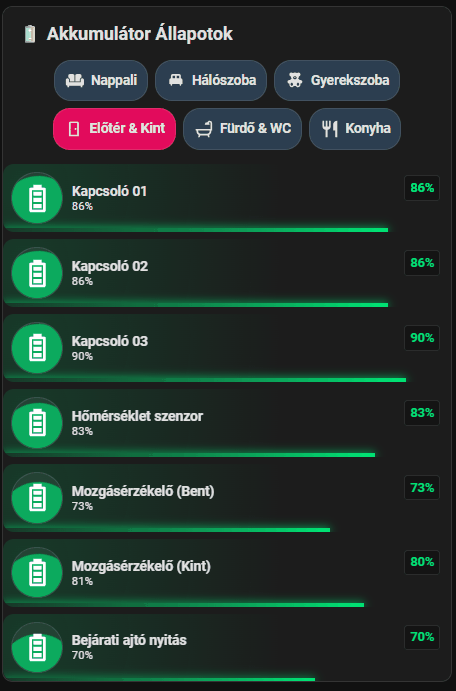

# 🔋 Akkumulátor Állapotok Dashboard (Fülekkel)

Ez a dokumentáció egy interaktív, helyiségenként (fülekre) bontott akkumulátor-figyelő dashboard kártyát mutat be. A kártya helytakarékos, átlátható, és egyedi CSS animációkkal (folyadékszint-szimuláció a kör alakú ikonon belül, alsó progress bar, és töltés esetén felszálló buborékok) teszi látványossá az okoseszközök (Zigbee szenzorok, kapcsolók) töltöttségi szintjét.

A kód különlegessége, hogy **YAML Horgonyokat (Anchors)** használ (`&akku_animacio` és `*akku_animacio`), így a komplex, 100+ soros CSS stílust csak egyszer kell definiálni, a többi kártya pedig erre hivatkozik. Ez radikálisan csökkenti a kód méretét és megkönnyíti a jövőbeli szerkesztést.

---

## 🎥 Előnézet

Így néz ki a helyiségekre bontott akkumulátor panel:

*(A kártya dinamikus megjelenése, a folyadékszint hullámzása és a színek változása működés közben:)*


---

## ⚠️ Előfeltételek

### 1. HACS (Home Assistant Community Store) Kártyák
* **[Mushroom Cards](https://github.com/piitaya/lovelace-mushroom)**
* **[Vertical Stack In Card](https://github.com/ofekasass/vertical-stack-in-card)**
* **[Card-mod](https://github.com/thomasloven/lovelace-card-mod)** (Az egyedi CSS animációkhoz elengedhetetlen!)

### 2. Segédentitás (Helper) a váltáshoz
A helyiségek közötti léptetéshez hozz létre egy Szám (Number) segédentitást:
* **Név:** `tabs_battery` (Azonosító: `input_number.tabs_battery`)
* **Minimum:** 1 | **Maximum:** 6 | **Lépésköz:** 1

---

## 💻 A Teljes Dashboard Kódja

Hozz létre egy új, üres kártyát (Kézi / Manual) a dashboardodon, és másold be az alábbi kódot. 

*(Figyelem: Az entitás neveket (`sensor...._battery_level` vagy `..._elem_akku`) cseréld le a saját okoseszközeid szenzoraira! Ha új eszközt adsz hozzá, egyszerűen másolj le egy meglévő kártyablokkot, és a `card_mod: *akku_animacio` hivatkozással automatikusan megkapja a teljes dizájnt!)*

```yaml
type: custom:vertical-stack-in-card
cards:
  - type: markdown
    content: '## 🔋 Akkumulátor Állapotok'

  # ==========================================
  # NAVIGÁCIÓS GOMBOK (SZOBÁK)
  # ==========================================
  - type: custom:mushroom-chips-card
    alignment: center
    card_mod:
      style: |
        ha-card { 
          margin-bottom: 16px; 
          --chip-height: 44px; 
          --chip-font-size: 15px; 
        }
        .chip-container {
          flex-wrap: wrap !important; 
          justify-content: center !important;
        }
    chips:
      - type: template
        content: Nappali
        icon: mdi:sofa
        tap_action: { action: perform-action, perform_action: input_number.set_value, target: { entity_id: input_number.tabs_battery }, data: { value: 1 } }
        card_mod:
          style: |
            ha-card { min-width: 100px !important; background-color: {{ '#E30B5C' if is_state('input_number.tabs_battery', '1.0') else '#2C3E50' }} !important; --chip-text-color: #FFFFFF !important; --chip-icon-color: #FFFFFF !important; }
            span { font-weight: {{ 'bold' if is_state('input_number.tabs_battery', '1.0') else '500' }} !important; color: var(--chip-text-color) !important; }
      - type: template
        content: Háló
        icon: mdi:bed-double
        tap_action: { action: perform-action, perform_action: input_number.set_value, target: { entity_id: input_number.tabs_battery }, data: { value: 2 } }
        card_mod:
          style: |
            ha-card { min-width: 100px !important; background-color: {{ '#E30B5C' if is_state('input_number.tabs_battery', '2.0') else '#2C3E50' }} !important; --chip-text-color: #FFFFFF !important; --chip-icon-color: #FFFFFF !important; }
            span { font-weight: {{ 'bold' if is_state('input_number.tabs_battery', '2.0') else '500' }} !important; color: var(--chip-text-color) !important; }
      - type: template
        content: Gyerek
        icon: mdi:teddy-bear
        tap_action: { action: perform-action, perform_action: input_number.set_value, target: { entity_id: input_number.tabs_battery }, data: { value: 3 } }
        card_mod:
          style: |
            ha-card { min-width: 100px !important; background-color: {{ '#E30B5C' if is_state('input_number.tabs_battery', '3.0') else '#2C3E50' }} !important; --chip-text-color: #FFFFFF !important; --chip-icon-color: #FFFFFF !important; }
            span { font-weight: {{ 'bold' if is_state('input_number.tabs_battery', '3.0') else '500' }} !important; color: var(--chip-text-color) !important; }
      - type: template
        content: Előtér & Kint
        icon: mdi:door
        tap_action: { action: perform-action, perform_action: input_number.set_value, target: { entity_id: input_number.tabs_battery }, data: { value: 4 } }
        card_mod:
          style: |
            ha-card { min-width: 110px !important; background-color: {{ '#E30B5C' if is_state('input_number.tabs_battery', '4.0') else '#2C3E50' }} !important; --chip-text-color: #FFFFFF !important; --chip-icon-color: #FFFFFF !important; }
            span { font-weight: {{ 'bold' if is_state('input_number.tabs_battery', '4.0') else '500' }} !important; color: var(--chip-text-color) !important; }
      - type: template
        content: Fürdő & WC
        icon: mdi:shower
        tap_action: { action: perform-action, perform_action: input_number.set_value, target: { entity_id: input_number.tabs_battery }, data: { value: 5 } }
        card_mod:
          style: |
            ha-card { min-width: 110px !important; background-color: {{ '#E30B5C' if is_state('input_number.tabs_battery', '5.0') else '#2C3E50' }} !important; --chip-text-color: #FFFFFF !important; --chip-icon-color: #FFFFFF !important; }
            span { font-weight: {{ 'bold' if is_state('input_number.tabs_battery', '5.0') else '500' }} !important; color: var(--chip-text-color) !important; }
      - type: template
        content: Konyha
        icon: mdi:silverware-fork-knife
        tap_action: { action: perform-action, perform_action: input_number.set_value, target: { entity_id: input_number.tabs_battery }, data: { value: 6 } }
        card_mod:
          style: |
            ha-card { min-width: 100px !important; background-color: {{ '#E30B5C' if is_state('input_number.tabs_battery', '6.0') else '#2C3E50' }} !important; --chip-text-color: #FFFFFF !important; --chip-icon-color: #FFFFFF !important; }
            span { font-weight: {{ 'bold' if is_state('input_number.tabs_battery', '6.0') else '500' }} !important; color: var(--chip-text-color) !important; }

  # ==========================================
  # 1. FÜL: NAPPALI
  # ==========================================
  - type: conditional
    conditions:
      - condition: state
        entity: input_number.tabs_battery
        state: "1.0"
    card:
      type: vertical-stack
      cards:
        # --- EZ AZ ELSŐ KÁRTYA TARTALMAZZA A HORGONYT (&akku_animacio) ---
        - type: custom:mushroom-entity-card
          entity: sensor.fibaro_livingroom_valve_battery_level
          icon: mdi:battery-high
          icon_color: white
          name: Radiátor szelep (Fibaro)
          primary_info: name
          secondary_info: state
          card_mod: &akku_animacio
            style:
              .: |
                ha-card {
                  --card-primary-font-size: 15px !important; --card-secondary-font-size: 12px !important; --card-primary-font-weight: bold !important;
                  
                  /* Töltés érzékelő (opcionális) */
                   
                  
                  
                  /* Szín logika RGB formátumban */
                  {% set level = states(config.entity) | replace('%', '') | replace(',', '.') | float(0) %}
                   
                   
                   
                    
                  
                  --custom-level: {{ level }}%; 
                  --custom-color: rgba({{ color }}, 0.8);
                  --custom-solid: rgb({{ color }});
                  --custom-bubble: {{ 'block' if is_charging else 'none' }};
                  
                  background: #1c1c1c !important; border: none !important; border-radius: 12px; position: relative; overflow: hidden;
                  background-image: radial-gradient(circle at 24px 24px, rgba({{ color }}, 0.15) 0%, transparent 60%) !important;
                }
                mushroom-shape-icon { --icon-size: 55px; }
                /* Jobb felső százalékos badge */
                ha-card::before {
                  content: '{{ states(config.entity) | replace("%", "") | replace(",", ".") | float(0) | round(0) }}%'; 
                  position: absolute; top: 12px; right: 12px; font-size: 1rem; font-weight: 700;
                  color: var(--custom-solid); background: rgba(0, 0, 0, 0.3); border: 1px solid rgba(255, 255, 255, 0.1); padding: 2px 6px; border-radius: 4px;
                }
                /* Alsó csík progress bar */
                ha-card::after {
                  content: ''; position: absolute; bottom: 0; left: 0; height: 4px; width: var(--custom-level);
                  background: linear-gradient(90deg, transparent, var(--custom-solid)); box-shadow: 0 0 10px var(--custom-solid); transition: width 0.5s ease;
                }
              mushroom-shape-icon$: |
                .shape { --liquid-level: var(--custom-level); --liquid-color: var(--custom-color); --bubble-display: var(--custom-bubble); background: rgba(255, 255, 255, 0.05) !important; overflow: hidden !important; position: relative; border: 1px solid rgba(255,255,255,0.1); }
                /* Folyadék animáció */
                .shape::before { content: ''; position: absolute; left: -50%; width: 200%; height: 200%; top: calc(100% - var(--liquid-level)); background: var(--liquid-color); border-radius: 40%; animation: liquid-wave 5s linear infinite; opacity: 0.8; }
                /* Töltés esetén buborékok */
                .shape::after { content: ''; display: var(--bubble-display); position: absolute; inset: 0; background-image: radial-gradient(2px 2px at 20% 80%, rgba(255,255,255,0.8), transparent), radial-gradient(2px 2px at 50% 70%, rgba(255,255,255,0.8), transparent), radial-gradient(3px 3px at 80% 90%, rgba(255,255,255,0.8), transparent); background-size: 100% 100%; animation: bubbles-rise 0.7s linear infinite; }
                /* Hófehér ikon erőszakolása */
                ha-state-icon, ha-icon { position: relative; z-index: 2; color: #FFFFFF !important; --icon-color: #FFFFFF !important; }
                @keyframes liquid-wave { 0% { transform: rotate(0deg); } 100% { transform: rotate(360deg); } }
                @keyframes bubbles-rise { 0% { transform: translateY(10px); opacity: 0; } 50% { opacity: 1; } 100% { transform: translateY(-20px); opacity: 0; } }
        
        # --- A többi kártya csak hivatkozik a horgonyra (*akku_animacio) ---
        - type: custom:mushroom-entity-card
          entity: sensor.ikea_switch_livingroom_on_off_01_elem_akku_4
          icon: mdi:battery-high
          icon_color: white
          name: Villanykapcsoló 01
          primary_info: name
          secondary_info: state
          card_mod: *akku_animacio
        - type: custom:mushroom-entity-card
          entity: sensor.ikea_switch_livingroom_on_off_02_elem_akku_4
          icon: mdi:battery-high
          icon_color: white
          name: Villanykapcsoló 02
          primary_info: name
          secondary_info: state
          card_mod: *akku_animacio
        - type: custom:mushroom-entity-card
          entity: sensor.xiaomi_temp_humidity_livingroom_01_elem_akku_2
          icon: mdi:battery-high
          icon_color: white
          name: Hőmérséklet szenzor
          primary_info: name
          secondary_info: state
          card_mod: *akku_animacio

  # ==========================================
  # 2. FÜL: HÁLÓSZOBA
  # ==========================================
  - type: conditional
    conditions:
      - condition: state
        entity: input_number.tabs_battery
        state: "2.0"
    card:
      type: vertical-stack
      cards:
        - type: custom:mushroom-entity-card
          entity: sensor.fibaro_bedroom_valve_battery_level
          icon: mdi:battery-high
          icon_color: white
          name: Radiátor szelep (Fibaro)
          primary_info: name
          secondary_info: state
          card_mod: *akku_animacio
        - type: custom:mushroom-entity-card
          entity: sensor.ikea_switch_bedroom_on_off_01_elem_akku_5
          icon: mdi:battery-high
          icon_color: white
          name: Villanykapcsoló
          primary_info: name
          secondary_info: state
          card_mod: *akku_animacio
        - type: custom:mushroom-entity-card
          entity: sensor.sonoff_orb_bedroom_01_elem_akku_2
          icon: mdi:battery-high
          icon_color: white
          name: Éjjeli lámpa 01
          primary_info: name
          secondary_info: state
          card_mod: *akku_animacio
        - type: custom:mushroom-entity-card
          entity: sensor.sonoff_orb_bedroom_02_elem_akku
          icon: mdi:battery-high
          icon_color: white
          name: Éjjeli lámpa 02
          primary_info: name
          secondary_info: state
          card_mod: *akku_animacio

  # ==========================================
  # 3. FÜL: GYEREKSZOBA
  # ==========================================
  - type: conditional
    conditions:
      - condition: state
        entity: input_number.tabs_battery
        state: "3.0"
    card:
      type: vertical-stack
      cards:
        - type: custom:mushroom-entity-card
          entity: sensor.fibaro_childroom_valve_battery_level
          icon: mdi:battery-high
          icon_color: white
          name: Radiátor szelep (Fibaro)
          primary_info: name
          secondary_info: state
          card_mod: *akku_animacio
        - type: custom:mushroom-entity-card
          entity: sensor.ikea_switch_childroom_on_off_01_elem_akku_4
          icon: mdi:battery-high
          icon_color: white
          name: Villanykapcsoló
          primary_info: name
          secondary_info: state
          card_mod: *akku_animacio
        - type: custom:mushroom-entity-card
          entity: sensor.xiaomi_temp_humidity_childroom_02_elem_akku
          icon: mdi:battery-high
          icon_color: white
          name: Hőmérséklet szenzor
          primary_info: name
          secondary_info: state
          card_mod: *akku_animacio

  # ==========================================
  # 4. FÜL: ELŐSZOBA & KINT
  # ==========================================
  - type: conditional
    conditions:
      - condition: state
        entity: input_number.tabs_battery
        state: "4.0"
    card:
      type: vertical-stack
      cards:
        - type: custom:mushroom-entity-card
          entity: sensor.ikea_switch_hall_on_off_01_elem_akku_4
          icon: mdi:battery-high
          icon_color: white
          name: Kapcsoló 01
          primary_info: name
          secondary_info: state
          card_mod: *akku_animacio
        - type: custom:mushroom-entity-card
          entity: sensor.ikea_switch_hall_on_off_02_elem_akku_4
          icon: mdi:battery-high
          icon_color: white
          name: Kapcsoló 02
          primary_info: name
          secondary_info: state
          card_mod: *akku_animacio
        - type: custom:mushroom-entity-card
          entity: sensor.ikea_switch_hall_on_off_03_elem_akku_4
          icon: mdi:battery-high
          icon_color: white
          name: Kapcsoló 03
          primary_info: name
          secondary_info: state
          card_mod: *akku_animacio
        - type: custom:mushroom-entity-card
          entity: sensor.xiaomi_temp_humidity_hall_01_elem_akku_2
          icon: mdi:battery-high
          icon_color: white
          name: Hőmérséklet szenzor
          primary_info: name
          secondary_info: state
          card_mod: *akku_animacio
        - type: custom:mushroom-entity-card
          entity: sensor.xiaomi_motion_sensor_hall_01_elem_akku
          icon: mdi:battery-high
          icon_color: white
          name: Mozgásérzékelő (Bent)
          primary_info: name
          secondary_info: state
          card_mod: *akku_animacio
        - type: custom:mushroom-entity-card
          entity: sensor.xiaomi_motion_sensor_outdoor_elem_akku
          icon: mdi:battery-high
          icon_color: white
          name: Mozgásérzékelő (Kint)
          primary_info: name
          secondary_info: state
          card_mod: *akku_animacio
        - type: custom:mushroom-entity-card
          entity: sensor.xiaomi_mijia_hall_door_window_01_elem_akku
          icon: mdi:battery-high
          icon_color: white
          name: Bejárati ajtó nyitás
          primary_info: name
          secondary_info: state
          card_mod: *akku_animacio

  # ==========================================
  # 5. FÜL: FÜRDŐ & WC
  # ==========================================
  - type: conditional
    conditions:
      - condition: state
        entity: input_number.tabs_battery
        state: "5.0"
    card:
      type: vertical-stack
      cards:
        - type: custom:mushroom-entity-card
          entity: sensor.xiaomi_temp_humidity_bathroom_01_elem_akku_2
          icon: mdi:battery-high
          icon_color: white
          name: Fürdő Hőmérséklet
          primary_info: name
          secondary_info: state
          card_mod: *akku_animacio
        - type: custom:mushroom-entity-card
          entity: sensor.bathroom_water_sensor_sonoff_snzb_05p_elem_akku
          icon: mdi:battery-high
          icon_color: white
          name: Vízszivárgás szenzor
          primary_info: name
          secondary_info: state
          card_mod: *akku_animacio
        - type: custom:mushroom-entity-card
          entity: sensor.motion_sensor_bathroom_tsnzb_03p_elem_akku
          icon: mdi:battery-high
          icon_color: white
          name: Fürdő Mozgásérzékelő
          primary_info: name
          secondary_info: state
          card_mod: *akku_animacio
        - type: custom:mushroom-entity-card
          entity: sensor.xiaomi_motion_sensor_wc_01_elem_akku
          icon: mdi:battery-high
          icon_color: white
          name: WC Mozgásérzékelő
          primary_info: name
          secondary_info: state
          card_mod: *akku_animacio
        - type: custom:mushroom-entity-card
          entity: sensor.ikea_of_sweden_rodret_dimmer_elem_akku_2
          icon: mdi:battery-high
          icon_color: white
          name: Fürdő Kapcsoló
          primary_info: name
          secondary_info: state
          card_mod: *akku_animacio
        - type: custom:mushroom-entity-card
          entity: sensor.ikea_of_sweden_rodret_dimmer_elem_akku
          icon: mdi:battery-high
          icon_color: white
          name: WC Kapcsoló
          primary_info: name
          secondary_info: state
          card_mod: *akku_animacio

  # ==========================================
  # 6. FÜL: KONYHA
  # ==========================================
  - type: conditional
    conditions:
      - condition: state
        entity: input_number.tabs_battery
        state: "6.0"
    card:
      type: vertical-stack
      cards:
        - type: custom:mushroom-entity-card
          entity: sensor.xiaomi_temp_humidity_kitchen_01_elem_akku_2
          icon: mdi:battery-high
          icon_color: white
          name: Hőmérséklet szenzor
          primary_info: name
          secondary_info: state
          card_mod: *akku_animacio
        - type: custom:mushroom-entity-card
          entity: sensor.ikea_switch_kitchen_on_off_01_elem_akku_4
          icon: mdi:battery-high
          icon_color: white
          name: Villanykapcsoló
          primary_info: name
          secondary_info: state
          card_mod: *akku_animacio

```
