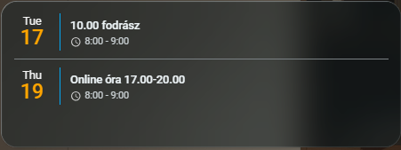

# 📅 Naptár Kártya

Ez a dokumentáció egy összetett, egyedi naptár kártya beállítását mutatja be, amely a következő 15 nap eseményeit listázza ki. A kártya különlegessége, hogy az események és a dátumok mellett az adott napi várható időjárást (hőmérséklet és ikon) is megjeleníti, így tökéletes áttekintést ad a napi tervezéshez.

## ⚠️ Előfeltételek a működéshez

Ennek a kártyának a használatához az alábbi integrációk és kiegészítők szükségesek:

1. **Google Naptár (Gmail) Integráció:** * A Home Assistantban be kell állítani a hivatalos **Google Calendar** integrációt.
   * Ehhez a Google Cloud Console-ban létre kell hozni egy API hozzáférést (OAuth Client ID és Secret), majd engedélyezni a Google Calendar API-t. 
   * Sikeres beállítás után jön létre a kártyán használt `calendar.csaladi_naptar` (vagy hasonló) entitás.
2. **HACS Kártya:** Telepíteni kell a HACS-ből (Home Assistant Community Store) a **Calendar Card Pro** (vagy hasonló nevű, a `custom:calendar-card-pro` típust biztosító) egyedi kártyát.
3. **Időjárás Integráció:** Mivel a kártya megjeleníti az időjárást, a Home Assistantban lennie kell egy beállított alapértelmezett időjárás-szolgáltatónak (pl. Met.no, OpenWeatherMap).

---

## Előnézet

*(Ide érdemes feltölteni egy képet a kész naptárról!)*



---

## YAML Konfiguráció

Hozd létre a dashboardon egy **Manual (Kézi)** kártyaként, és másold be az alábbi kódot. 

> **Tipp:** Ha a naptárad entitásának neve eltér (pl. `calendar.sajat_email_gmail_com`), azt az `entities:` listában tudod módosítani.

```yaml
type: custom:calendar-card-pro
entities:
  - calendar.csaladi_naptar
days_to_show: 15
compact_events_to_show: 2
day_separator_width: 1px
day_separator_color: gray
today_indicator: glow
day_color: orange
show_month: false
weekend_weekday_color: gray
show_progress_bar: true
weather:
  position: date
  date:
    show_conditions: true
    show_high_temp: true
    show_low_temp: false
    icon_size: 14px
    font_size: 12px
    color: var(--primary-text-color)
  event:
    show_conditions: true
    show_temp: true
    icon_size: 14px
    font_size: 12px
    color: var(--primary-text-color)
tap_action:
  action: expand
refresh_interval: 60
grid_options:
  columns: full
  rows: 3

```