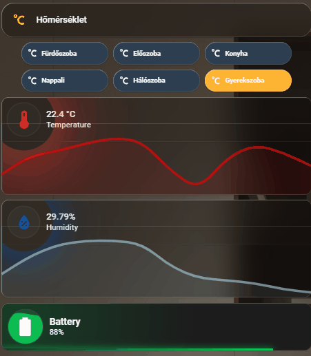

# 🌡️ Okosotthon Klíma Panel (Füles Navigációval)

Ez a dokumentáció egy rendkívül látványos, prémium megjelenésű klíma és páratartalom vezérlőpanelt mutat be. A rendszer egy "füles" (Tab) navigációra épül, amivel helyet spórolunk a dashboardon: a szobák gombjaira kattintva az alattuk lévő kártyák dinamikusan cserélődnek. 

A panel különlegességét az egyedi CSS animációk adják:
* **Hőmérséklet & Páratartalom:** Az értékektől függően (hideg/meleg, száraz/párás) változó színű, izzó és "lélegző" glória effektus az ikonok körül, mögöttük egy lágyan áttűnő grafikonnal.
* **Akkumulátor:** A kártya egy folyadékkal töltött üveget szimulál, ahol a folyadék szintje (és hullámzása) valós időben követi az elem töltöttségét.

## ⚠️ Előfeltételek a működéshez

### 1. HACS (Home Assistant Community Store) Kártyák
* **[Mushroom Cards](https://github.com/piitaya/lovelace-mushroom):** A letisztult kártyákhoz és a gombsorhoz.
* **[Mini Graph Card](https://github.com/kalkih/mini-graph-card):** Az áttetsző, kártyába olvadó grafikonokhoz.
* **[Vertical Stack In Card](https://github.com/ofekasass/vertical-stack-in-card):** A kártyák és grafikonok láthatatlan egybeépítéséhez.
* **[Card-mod](https://github.com/thomasloven/lovelace-card-mod):** A komplex CSS animációk és színátmenetek futtatásához.

### 2. Segédentitás (Helper)
A fülek közötti váltáshoz létre kell hozni egy szám alapú segédentitást:
* **Típus:** Szám (Number)
* **Név:** `tabs_homerseklet` (Az entitás azonosítója `input_number.tabs_homerseklet` lesz)
* **Beállítások:** Minimum: `1`, Maximum: `6` (attól függően hány szobád van), Lépésköz (Step): `1`.

---

## Előnézet

Az alábbi animáción látható a rendszer működés közben:



---

## Felépítés és YAML Konfiguráció

A dashboardra a következő elemeket kell egymás alá (vagy egy Vertical Stack-be) helyezni:

### 1. Fejléc Kártya
Ez adja meg a szekció címét.
```yaml
type: custom:mushroom-template-card
primary: Hőmérséklet
icon: mdi:temperature-celsius
color: '#FFB433'
features_position: bottom
grid_options:
  columns: 12
  rows: 1

```

### 2. Navigációs Gombsor (Tabs)

Ezek a gombok állítják át az `input_number` értékét 1 és 6 között. Az aktív gomb automatikusan narancssárgára vált, míg az inaktívak elegáns sötétkéken maradnak, pulzáló ikonokkal.

```yaml
type: custom:mushroom-chips-card
alignment: center
chips:
  - type: template
    icon: mdi:temperature-celsius
    content: Fürdőszoba
    tap_action:
      action: perform-action
      perform_action: input_number.set_value
      target:
        entity_id: input_number.tabs_homerseklet
      data:
        value: 1
    card_mod:
      style: |
        ha-card {
          min-width: 140px !important;
          max-width: 140px !important;
          background-color: {{ '#FFB433' if is_state('input_number.tabs_homerseklet', '1.0') else '#2C3E50' }} !important;
          position: relative !important;
        }
        .content { justify-content: center !important; }
        ha-state-icon {
          position: absolute !important;
          left: 12px !important;
          color: {{ '#1A1A1A' if is_state('input_number.tabs_homerseklet', '1.0') else '#FFFFFF' }} !important;
          animation: pulse 2s infinite ease-in-out !important;
        }
        span {
          color: {{ '#1A1A1A' if is_state('input_number.tabs_homerseklet', '1.0') else '#FFFFFF' }} !important;
          font-weight: {{ 'bold' if is_state('input_number.tabs_homerseklet', '1.0') else '500' }} !important;
          padding-left: 15px !important;
        }
        @keyframes pulse { 0% { transform: scale(1); } 50% { transform: scale(1.3); } 100% { transform: scale(1); } }
  # ... Másold ide a többi gombot a korábbi kód alapján (2-től 6-ig) ...

```

### 3. Dinamikus Szoba Kártyák (Conditional Cards)

Minden szobához létre kell hozni egy `conditional` kártyát, amely csak akkor jelenik meg, ha az adott szoba sorszáma aktív. Alább található a **Referencia Kártya (1.0 - Fürdőszoba)** teljes kódja. A többi szobához ezt kell lemásolni, átírva a `state` számot és a 3 darab `sensor.xiaomi...` entitást!

```yaml
type: conditional
conditions:
  - condition: state
    entity: input_number.tabs_homerseklet
    state: "1.0"
card:
  square: false
  type: grid
  columns: 1
  cards:
    # --- 1. HŐMÉRSÉKLET ---
    - type: custom:vertical-stack-in-card
      card_mod:
        style: |
          ha-card { border-radius: 12px; overflow: hidden; }
      cards:
        - type: custom:mushroom-entity-card
          entity: sensor.xiaomi_temp_humidity_bathroom_01_homerseklet_2
          tap_action:
            action: more-info
          icon: mdi:thermometer
          name: Temperature
          primary_info: state
          secondary_info: name
          card_mod:
            style:
              mushroom-shape-icon$: |
                .shape {
                  
                  
                  
                  
                  
                  
                  

                  
                    
                    
                  
                    
                    
                    
                    
                    
                    
                  
                    
                    
                    
                    
                    
                    
                  
                    
                    
                    
                    
                    
                    
                  
                    
                    
                    
                    
                    
                    
                  

                  --temp-rgb: {{ rgb }};
                  --temp-intensity: {{ intensity }};
                  --shape-animation: {{ anim }} {{ duration }}s ease-in-out infinite;
                  --temp-glow-animation: {{ glow_anim }} {{ (duration * 0.9) | round(2) }}s ease-in-out infinite;
                  --temp-halo-animation: {{ halo_anim }} {{ (duration * 1.15) | round(2) }}s ease-in-out infinite;

                  opacity: 1;
                  --icon-color: rgba({{ rgb }}, 1);
                  background-color: rgba(77, 77, 77,0.1) !important;
                  box-shadow: none !important;
                  border: 1px solid rgba(255,255,255,0.06);
                  position: relative;
                  animation: var(--shape-animation);
                }
                .shape::before, .shape::after { content: ''; position: absolute; border-radius: inherit; pointer-events: none; }
                .shape::before { inset: -8px; animation: var(--temp-glow-animation); }
                .shape::after { inset: -22px; animation: var(--temp-halo-animation); mix-blend-mode: screen; }

                @keyframes temp-cold-breathe { 0%, 100% { transform: scale(0.96); } 50% { transform: scale(1.03); } }
                @keyframes temp-cold-glow { 50% { box-shadow: 0 0 30px 4 rgba(var(--temp-rgb), 0.95), 0 0 50px 10px rgba(var(--temp-rgb), 0.85); } }
                @keyframes temp-cold-halo { 50% { box-shadow: 0 0 130px 36px rgba(var(--temp-rgb), 0.5), 0 -34px 100px -8px rgba(240, 250, 255, 0.8); } }
                @keyframes temp-cool-wave { 0%, 100% { transform: translateX(0); } 50% { transform: translateX(1px) translateY(-1px); } }
                @keyframes temp-cool-glow { 50% { box-shadow: 0 0 28px 2 rgba(var(--temp-rgb), 0.95), 0 0 48px 12px rgba(var(--temp-rgb), 0.85); } }
                @keyframes temp-cool-halo { 50% { box-shadow: 0 0 140px 42px rgba(var(--temp-rgb), 0.45), 0 30px 110px -10px rgba(0, 255, 255, 0.5); } }
                @keyframes temp-comfy-breathe { 0%, 100% { transform: scale(0.98); } 50% { transform: scale(1.05); } }
                @keyframes temp-comfy-glow { 50% { box-shadow: 0 0 26px 4 rgba(var(--temp-rgb), 0.9), 0 0 42px 10px rgba(var(--temp-rgb), 0.85); } }
                @keyframes temp-comfy-halo { 50% { box-shadow: 0 0 120px 40px rgba(var(--temp-rgb), 0.45), 0 26px 80px -10px rgba(180,255,200,0.5); } }
                @keyframes temp-warm-pulse { 0%, 100% { transform: scale(1); } 50% { transform: scale(1.07); } }
                @keyframes temp-warm-glow { 50% { box-shadow: 0 0 30px 4 rgba(var(--temp-rgb), 0.95), 0 0 54px 14px rgba(var(--temp-rgb), 0.9); } }
                @keyframes temp-warm-halo { 50% { box-shadow: 0 0 140px 48px rgba(var(--temp-rgb), 0.55), 0 26px 100px -10px rgba(255,210,150,0.5); } }
                @keyframes temp-hot-shimmer { 0%, 100% { transform: scale(1); filter: blur(0); } 50% { transform: scale(1.08); filter: blur(0.6px); } }
                @keyframes temp-hot-glow { 50% { box-shadow: 0 0 34px 6 rgba(var(--temp-rgb), 1), 0 0 62px 14px rgba(var(--temp-rgb), 0.95); } }
                @keyframes temp-hot-halo { 50% { box-shadow: 0 0 160px 60px rgba(var(--temp-rgb), 0.6), 0 34px 120px -12px rgba(255,150,100,0.6); } }
              .: |
                mushroom-shape-icon { --icon-size: 50px; }
                ha-card { background: none; box-shadow: none; border: none; }
        - type: custom:mini-graph-card
          entities:
            - sensor.xiaomi_temp_humidity_bathroom_01_homerseklet_2
          hours_to_show: 24
          line_width: 4
          show: { name: false, icon: false, state: false, labels: false, legend: false }
          color_thresholds:
            - value: 0
              color: blue
            - value: 16
              color: lightblue
            - value: 18
              color: orange
            - value: 21
              color: red
          card_mod:
            style: |
              ha-card {
                background: none !important; box-shadow: none !important; border: none !important;
                opacity: 0.6; margin-top: -30px !important; padding-bottom: 0px !important;
              }

    # --- 2. PÁRATARTALOM ---
    - type: custom:vertical-stack-in-card
      card_mod:
        style: |
          ha-card { border-radius: 12px; overflow: hidden; }
      cards:
        - type: custom:mushroom-entity-card
          entity: sensor.xiaomi_temp_humidity_bathroom_01_paratartalom_2
          tap_action:
            action: more-info
          icon: mdi:water-percent
          name: Humidity
          primary_info: state
          secondary_info: name
          card_mod:
            style:
              mushroom-shape-icon$: |
                .shape {
                  
                  
                  
                  
                  
                  

                  
                        
                  
                    
                  
                        
                  

                  --hum-rgb: {{ rgb }};
                  --shape-animation: {{ anim }} {{ duration }}s ease-in-out infinite;
                  --hum-glow-animation: {{ glow_anim }} {{ (duration * 0.9) | round(2) }}s ease-in-out infinite;
                  --hum-halo-animation: {{ halo_anim }} {{ (duration * 1.1) | round(2) }}s ease-in-out infinite;

                  --icon-color: rgba({{ rgb }}, 1);
                  background-color: rgba(77,77,77,0.2) !important;
                  box-shadow: none !important; border: 1px solid rgba(255,255,255,0.06); opacity: 1; position: relative; animation: var(--shape-animation);
                }
                .shape::before, .shape::after { content: ''; position: absolute; border-radius: inherit; pointer-events: none; }
                .shape::before { inset: -8px; animation: var(--hum-glow-animation); }
                .shape::after { inset: -22px; animation: var(--hum-halo-animation); mix-blend-mode: screen; }

                @keyframes hum-good-breathe { 0%, 100% { transform: scale(0.98); } 50% { transform: scale(1.04); } }
                @keyframes hum-good-glow { 50% { box-shadow: 0 0 24px 4 rgba(var(--hum-rgb), 0.9), 0 0 44px 10px rgba(var(--hum-rgb), 0.85); } }
                @keyframes hum-good-halo { 50% { box-shadow: 0 0 120px 40px rgba(var(--hum-rgb), 0.45), 0 26px 90px -10px rgba(200,240,255,0.45); } }
                @keyframes hum-mid-wave { 0%, 100% { transform: translateX(0); } 50% { transform: translateX(1px) translateY(-1px); } }
                @keyframes hum-mid-glow { 50% { box-shadow: 0 0 28px 3 rgba(var(--hum-rgb), 0.95), 0 0 48px 10px rgba(var(--hum-rgb), 0.85); } }
                @keyframes hum-mid-halo { 50% { box-shadow: 0 0 135px 42px rgba(var(--hum-rgb), 0.5), 0 28px 105px -10px rgba(100,210,255,0.5); } }
                @keyframes hum-bad-pulse { 0%, 100% { transform: scale(0.97); } 40% { transform: scale(1.03); } }
                @keyframes hum-bad-glow { 50% { box-shadow: 0 0 26px 4 rgba(var(--hum-rgb), 0.95), 0 0 44px 12px rgba(var(--hum-rgb), 0.9); } }
                @keyframes hum-bad-halo { 50% { box-shadow: 0 0 130px 40px rgba(var(--hum-rgb), 0.6), 0 26px 100px -8px rgba(0,90,190,0.65); } }
              .: |
                mushroom-shape-icon { --icon-size: 50px; }
                ha-card { background: none; box-shadow: none; border: none; }
        - type: custom:mini-graph-card
          entities:
            - sensor.xiaomi_temp_humidity_bathroom_01_paratartalom_2
          line_color: lightblue
          line_width: 4
          hours_to_show: 24
          show: { name: false, icon: false, state: false, labels: false, legend: false }
          card_mod:
            style: |
              ha-card {
                background: none !important; box-shadow: none !important; border: none !important;
                opacity: 0.6; margin-top: -30px !important; padding-bottom: 0px !important;
              }

    # --- 3. AKKUMULÁTOR (Folyadék animációval) ---
    - type: custom:mushroom-entity-card
      entity: sensor.xiaomi_temp_humidity_bathroom_01_elem_akku_2
      tap_action:
        action: more-info
      icon: mdi:battery
      icon_color: white
      primary_info: name
      secondary_info: state
      name: Battery
      card_mod:
        style:
          .: |
            ha-card {
              --card-primary-font-size: 15px !important; --card-secondary-font-size: 12px !important; --card-primary-font-weight: bold !important;
              
                 
                 
                

              --custom-level: {{ level }}%; --custom-color: rgba({{ color }}, 0.8);
              --text-color: {{ 'rgba(' ~ color ~ ', 1)' if level < 101 else 'rgba(255,255,255,0.7)' }};
              background: #1c1c1c !important; border: none !important; border-radius: 12px; position: relative; overflow: hidden;
              background-image: radial-gradient(circle at 24px 24px, rgba({{ color }}, 0.15) 0%, transparent 60%) !important;
            }
            mushroom-shape-icon { --icon-size: 55px; }
            ha-card::before {
              content: '{{ states(config.entity) | float(0) | round(0) }}%'; position: absolute; top: 12px; right: 12px; font-size: 1rem; font-weight: 700;
              color: var(--text-color); background: rgba(0, 0, 0, 0.3); border: 1px solid rgba(255, 255, 255, 0.1); padding: 2px 6px; border-radius: 4px;
            }
            ha-card::after {
              content: ''; position: absolute; bottom: 0; left: 0; height: 4px; width: var(--custom-level);
              background: linear-gradient(90deg, transparent, var(--custom-color)); box-shadow: 0 0 10px var(--custom-color);
            }
          mushroom-shape-icon$: |
            .shape {
              --liquid-level: var(--custom-level); --liquid-color: var(--custom-color);
              background: rgba(255, 255, 255, 0.05) !important; overflow: hidden !important; position: relative; border: 1px solid rgba(255,255,255,0.1);
            }
            .shape::before {
              content: ''; position: absolute; left: -50%; width: 200%; height: 200%;
              top: calc(100% - var(--liquid-level)); background: var(--liquid-color); border-radius: 40%; animation: liquid-wave 6s linear infinite; opacity: 0.8;
            }
            ha-icon { position: relative; z-index: 2; mix-blend-mode: overlay; color: white !important; }
            @keyframes liquid-wave { 0% { transform: rotate(0deg); } 100% { transform: rotate(360deg); } }

```