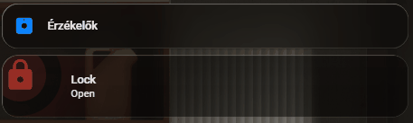

# 🚪 Ajtó/Ablak Nyitásérzékelő és Zár Kártya

Ez a dokumentáció egy feltételesen megjelenő, animált [Mushroom Entity Card](https://github.com/piitaya/lovelace-mushroom) beállítását mutatja be. A kártya kifejezetten a biztonságra fókuszál: csak akkor jelenik meg a műszerfalon (dashboard), ha a megfigyelt ajtó vagy ablak nyitva van.

## Működés és Vizuális Visszajelzések

A kártya két fontos mechanizmust ötvöz:
1. **Feltételes megjelenítés (Conditional Card):** A kártya rejtve marad, amíg az ajtó/ablak zárva van, ezzel tisztán tartva a felületet.
2. **Kiterjedt `card-mod` animációk:** Ha a feltételek teljesülnek (pl. nyitás történik és egy kiegészítő entitás is aktív), a kártya ikonja hatalmas, pulzáló fényt (Ultraglow) kap, maga az ikon pedig a zár állapotától függően mozog (nyitva, zárás/nyitás folyamatban, vagy biztonságosan zárva).

## Előnézet (Animáció)

Az alábbi animáción látható a kártya működés közben, amint egy ajtó nyitására előtűnik az animált riasztó/zár ikon:



---

## YAML Konfiguráció és CSS kód

A kártya létrehozásához hozz létre egy **Manual (Kézi)** kártyát a dashboardon, és másold be az alábbi kódot. 

> **Fontos beállítási lépések:**
> * A `conditions` részben módosíthatod, hogy mikor jelenjen meg a kártya (jelenleg a nyitásérzékelő `on` állapotára van kötve).
> * A `card_mod` -> `USER CONFIG` részben megadhatsz egy másodlagos entitást (pl. egy okoskonnektort vagy bármilyen más szenzort), ami az extra vizuális animációkat (Glow és mozgás) aktiválja.

```yaml
type: conditional
conditions:
  - condition: state
    entity: binary_sensor.xiaomi_mijia_hall_door_window_01_nyilik
    state: "on"
card:
  type: custom:mushroom-entity-card
  entity: binary_sensor.xiaomi_mijia_hall_door_window_01_nyilik
  tap_action:
    action: toggle
  icon: mdi:lock
  icon_color: red
  name: Lock
  card_mod:
    style:
      mushroom-shape-icon$: |
        .shape {
          {# ========== USER CONFIG ========== #}
          {# true = number mode, false = state mode #}
          

          {# STATE MODE SETTINGS #}
          
          

          {# OPTIONAL: NUMBER MODE SETTINGS #}
          
          
          {# '>' '<' '=' '>=' '<=' #}
          
          
          
          {# ========== END USER CONFIG ====== #}

          {# ---------- TRIGGER DECISION LOGIC ---------- #}
          
            
            
              
            
              
            
              
            
              
            
              
            
              
            
          
            
          
          {# ---------- END TRIGGER LOGIC ---------- #}


          
            
              --shape-animation: lock-secure 2.3s ease-in-out infinite;
            
              --shape-animation: lock-action 0.7s ease-in-out infinite;
            
              --shape-animation: lock-open 1.6s ease-in-out infinite;
            

            opacity: 1;

            /* HUGE glow system */
            --glow-1: 0 0 25px 8px rgba(var(--rgb-{{ config.icon_color }}), 1);
            --glow-2: 0 0 55px 18px rgba(var(--rgb-{{ config.icon_color }}), 0.7);
            --glow-3: 0 0 95px 35px rgba(var(--rgb-{{ config.icon_color }}), 0.45);
            --glow-anim: lock-ultraglow 2.2s ease-in-out infinite;

          
            --shape-animation: none;
            --glow-1: none;
            --glow-2: none;
            --glow-3: none;
            --glow-anim: none;
            opacity: 0.6;
          

          transform-origin: 50% 50%;
          position: relative;
        }

        /* Glow layers */
        .shape::before,
        .shape::after {
          content: '';
          position: absolute;
          inset: -8px;
          border-radius: inherit;
          pointer-events: none;
        }

        .shape::before {
          box-shadow: var(--glow-1), var(--glow-2), var(--glow-3);
          animation: var(--glow-anim);
        }

        .shape::after {
          inset: -18px;
          box-shadow: 0 0 120px 40px rgba(var(--rgb-{{ config.icon_color }}), 0.25);
          opacity: 0.9;
          animation: var(--glow-anim);
        }

        @keyframes lock-ultraglow {
          0% {
            opacity: 0.9;
            filter: brightness(1);
          }
          50% {
            opacity: 1;
            filter: brightness(1.4);
          }
          100% {
            opacity: 0.9;
            filter: brightness(1);
          }
        }

        @keyframes lock-secure {
          0%   { transform: rotate(0deg) scale(1); }
          15%  { transform: rotate(-12deg) scale(1.02); }
          30%  { transform: rotate(2deg) scale(1.03); }
          40%  { transform: rotate(0deg) scale(1); }
          100% { transform: rotate(0deg) scale(1); }
        }

        @keyframes lock-action {
          0%   { transform: rotate(-25deg) scale(0.96); }
          50%  { transform: rotate(25deg) scale(1.04); }
          100% { transform: rotate(-25deg) scale(0.96); }
        }

        @keyframes lock-open {
          0%   { transform: rotate(10deg); }
          50%  { transform: rotate(18deg); }
          100% { transform: rotate(10deg); }
        }
      .: |
        mushroom-shape-icon {
          --icon-size: 65px;
          display: flex;
          margin: -18px 0 10px -20px !important;
          padding-right: 20px;
        }
        ha-card {
          clip-path: inset(0 0 0 0 round var(--ha-card-border-radius, 12px));
        }
  grid_options:
    columns: 12
    rows: 2

```
