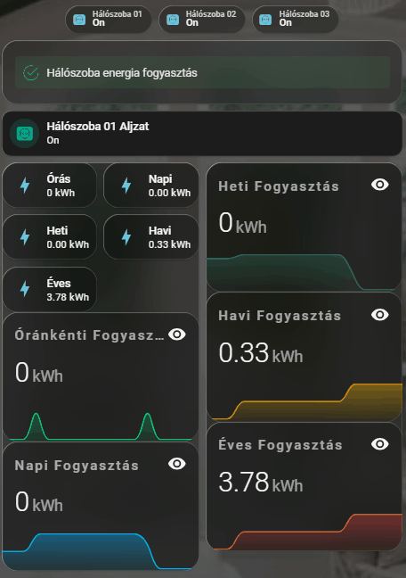

# ⚡ Energia Fogyasztás Dashboard (Füles elrendezés)

Ez a dokumentáció egy professzionális, helyiségekre és eszközökre bontott energiamonitorozó dashboardot mutat be. A panel a Home Assistant "Sections" (Szakaszok) nézetét használja, és a felső jelvények (badges) segítségével lehet navigálni az egyes okosaljzatok statisztikái között. 

A dizájn fénypontjai a bekapcsolt állapotban pulzáló főkapcsoló, a kompakt csempés adatközlés, valamint a dinamikusan rajzolódó, fogyasztás alapján színt váltó (zöld-sárga-piros) grafikonok.

---

## 🎥 Előnézet

Így néz ki a dinamikus energiamonitorozó panel működés közben:

*(A kártya animációi, a grafikonok betöltése és a főkapcsoló pulzálása:)*


---

## ⚠️ Előfeltételek

A kártya működéséhez szükséges egy adatokat szolgáltató okosaljzat (amely méri a pillanatnyi és összesített fogyasztást), valamint az alábbi vizuális kiegészítők:

### 1. HACS (Home Assistant Community Store) Kártyák
* **[Mushroom Cards](https://github.com/piitaya/lovelace-mushroom)**: A pulzáló főkapcsolóhoz.
* **[Mini Graph Card](https://github.com/kalkih/mini-graph-card)**: Az animált, színátmenetes és színváltós grafikonokhoz.
* **[Vertical Stack In Card](https://github.com/ofekasass/vertical-stack-in-card)**: A kártyák elegáns, keret nélküli egybeolvasztásához.
* **[Card-mod](https://github.com/thomasloven/lovelace-card-mod)**: A pulzáló CSS animációkhoz.

### 2. Segédentitás (Helper) a váltáshoz
A fülek (eszközök) közötti léptetéshez hozz létre egy Szám (Number) segédentitást:
* **Név:** `energy_metering` (Azonosító: `input_number.energy_metering`)
* **Minimum:** 1 | **Maximum:** 50 (attól függően, hány eszközöd van) | **Lépésköz:** 1

---

## 💻 Minta Kód (Egy helyiség alapváza)

Mivel a teljes dashboard kódja rendkívül hosszú lenne, az alábbi kód **egyetlen helyiség (Hálószoba) és annak egyetlen eszközének (1.0-ás állapot)** tökéletesített vázát tartalmazza. Ezt a blokkot sokszorosítva és a `state:` értékeket átírva könnyedén felépítheted a teljes házat.

Ezt a kódot a dashboard **Nyers konfigurációs szerkesztőjébe (Raw configuration editor)** kell beilleszteni a `views:` rész alá:

```yaml
  - title: Hálószoba
    icon: mdi:bed
    theme: visionos
    type: sections
    max_columns: 2
    
    # --- NAVIGÁCIÓS JELVÉNYEK (GOMBOK) ---
    badges:
      - type: entity
        show_name: true
        show_state: true
        show_icon: true
        entity: switch.fibaro_wall_plug_bedroom_01
        name: Hálószoba 01
        icon: phu:smart-plug-schuko
        show_entity_picture: true
        color: teal
        state_content: state
        tap_action: 
          action: perform-action
          perform_action: input_number.set_value
          target: { entity_id: input_number.energy_metering }
          data: { value: 1 }

    # --- TARTALMI RÉSZ (GRAFIKONOK ÉS CSEMÉK) ---
    sections:
      - type: grid
        cards:
          - type: markdown
            content: <ha-alert alert-type="success">Hálószoba energia fogyasztás</ha-alert>
          
          # === HÁLÓSZOBA 01 STATISZTIKÁK (State 1.0) ===
          - type: conditional
            conditions: 
              - condition: state
                entity: input_number.energy_metering
                state: '1.0'
            card:
              type: vertical-stack
              cards:
                # 1. Animált főkapcsoló (Teljes szélesség)
                - type: custom:mushroom-entity-card
                  entity: switch.fibaro_wall_plug_bedroom_01
                  name: Hálószoba 01 Aljzat
                  icon: phu:smart-plug-schuko
                  icon_color: teal
                  tap_action: { action: toggle }
                  card_mod:
                    style: |
                      ha-card { background: #1c1c1c !important; border: none !important; border-radius: 12px; }
                      mushroom-shape-icon { animation: {{ 'pulse-glow 2s infinite' if is_state(config.entity, 'on') else 'none' }}; }
                      @keyframes pulse-glow { 0% { box-shadow: 0 0 0 0 rgba(0, 150, 136, 0.4); } 70% { box-shadow: 0 0 0 15px rgba(0, 150, 136, 0); } 100% { box-shadow: 0 0 0 0 rgba(0, 150, 136, 0); } }
                
                # 2. Statisztikák és grafikonok (2 Oszlopos Rács)
                - type: grid
                  columns: 2
                  square: false
                  cards:
                    
                    # BAL OSZLOP (Rövid távú adatok)
                    - type: custom:vertical-stack-in-card
                      cards:
                        - type: grid
                          columns: 2
                          square: false
                          cards:
                            - type: tile
                              entity: sensor.hourly_energy_bedroom_01_peak
                              name: Órás
                              color: teal
                            - type: tile
                              entity: sensor.daily_energy_bedroom_01_peak
                              name: Napi
                              color: teal
                            - type: tile
                              entity: sensor.weekly_energy_bedroom_01_peak
                              name: Heti
                              color: teal
                            - type: tile
                              entity: sensor.monthly_energy_bedroom_01_peak
                              name: Havi
                              color: teal
                            - type: tile
                              entity: sensor.yearly_energy_bedroom_01_peak
                              name: Éves
                              color: teal
                        - type: custom:mini-graph-card
                          entities: [{ entity: sensor.hourly_energy_bedroom_01_peak }]
                          name: Óránkénti Fogyasztás
                          hour24: true
                          hours_to_show: 24
                          points_per_hour: 1
                          line_width: 3
                          animate: true
                          show: { graph: line, fill: fade }
                          color_thresholds: [{ value: 0, color: "#00e676" }, { value: 0.5, color: "#ff9800" }, { value: 1.5, color: "#f44336" }]
                        - type: custom:mini-graph-card
                          entities: [{ entity: sensor.daily_energy_bedroom_01_peak }]
                          name: Napi Fogyasztás
                          hour24: true
                          hours_to_show: 24
                          points_per_hour: 1
                          line_width: 3
                          animate: true
                          show: { graph: line, fill: fade }
                          color_thresholds: [{ value: 0, color: "#00b0ff" }, { value: 2, color: "#ff9800" }, { value: 5, color: "#f44336" }]
                    
                    # JOBB OSZLOP (Hosszú távú adatok)
                    - type: custom:vertical-stack-in-card
                      cards:
                        - type: custom:mini-graph-card
                          entities: [{ entity: sensor.weekly_energy_bedroom_01_peak }]
                          name: Heti Fogyasztás
                          hour24: true
                          hours_to_show: 24
                          points_per_hour: 1
                          line_width: 3
                          animate: true
                          show: { graph: line, fill: fade }
                          color_thresholds: [{ value: 0, color: "#326e5d" }, { value: 10, color: "#ff9800" }, { value: 20, color: "#f44336" }]
                        - type: custom:mini-graph-card
                          entities: [{ entity: sensor.monthly_energy_bedroom_01_peak }]
                          name: Havi Fogyasztás
                          hour24: true
                          hours_to_show: 24
                          points_per_hour: 1
                          line_width: 3
                          animate: true
                          show: { graph: line, fill: fade }
                          color_thresholds: [{ value: 0, color: "#fcba03" }, { value: 40, color: "#ff9800" }, { value: 80, color: "#f44336" }]
                        - type: custom:mini-graph-card
                          entities: [{ entity: sensor.yearly_energy_bedroom_01_peak }]
                          name: Éves Fogyasztás
                          hour24: true
                          hours_to_show: 24
                          points_per_hour: 1
                          line_width: 3
                          animate: true
                          show: { graph: line, fill: fade }
                          color_thresholds: [{ value: 0, color: "#f04949" }, { value: 300, color: "#ff9800" }, { value: 600, color: "#f44336" }]

```

> **Tipp a kalibráláshoz:** A `color_thresholds` alatti `value:` értékeket az adott eszköz fogyasztási szokásaihoz érdemes igazítani. Például egy mosógépnél a piros riasztási zóna (érték) sokkal magasabb legyen, mint egy éjjeli lámpánál!

```
