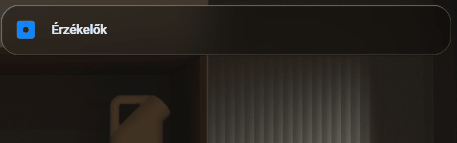

# 🚶‍♂️ Mozgás- és Jelenlétérzékelő Kártya (Radar Animációval)

Ez a dokumentáció egy feltételesen megjelenő [Mushroom Entity Card](https://github.com/piitaya/lovelace-mushroom) beállítását mutatja be. A kártya kifejezetten arra szolgál, hogy vizuálisan, egy látványos "radar" (pásztázó) animációval jelezze, ha egy helyiségben (pl. Fürdőszoba) mozgást vagy jelenlétet érzékel a rendszer.

## Működés és Vizuális Visszajelzések

A kártya a következő logikára és animációkra épül:
1. **Feltételes megjelenítés (Conditional Card):** A kártya teljesen rejtve marad, amíg a szoba üres. Ezzel elkerülhető a dashboard zsúfoltsága.
2. **Radar Animáció (`card-mod`):** Amint mozgás történik, a kártya megjelenik, és az ikon körül egy 360 fokban forgó, "kúpos színátmenet" (conic-gradient) kezd el forogni, szimulálva egy letapogató radart.
3. **Háttér és Kiemelés:** A kártya háttere egy diszkrét sárgás sugárirányú színátmenetet kap, az alján pedig egy világító csík (progress bar hatás) jelenik meg.

## ⚠️ Fontos megjegyzés Zigbee (ZHA) eszközökhöz
A Sonoff SNZB-03P (és sok más modern Zigbee mozgásérzékelő) esetében az újabb koordinátorok (pl. SMLIGHT) és a ZHA integráció a valós mozgásadatokat gyakran a **Foglaltság (Occupancy)** csatornára küldik, míg az alapértelmezett "Motion" csatorna inaktív maradhat. 
Mindig ellenőrizd, hogy a `_foglaltsag` vagy `_occupancy` végződésű entitást (Entity ID) használd a kód mindkét pontján (a feltételnél és a kártya entitásánál is), különben az animáció nem fog elindulni!

---

## Előnézet (Animáció)

Az alábbi animáción látható a kártya működés közben, amint mozgás hatására megjelenik és pásztázni kezd:



---

## YAML Konfiguráció és CSS kód

Hozd létre a dashboardon egy **Manual (Kézi)** kártyaként, és másold be az alábbi kódot. Ne felejtsd el az `entity` mezőket a saját jelenlét-érzékelőd pontos azonosítójára cserélni!

```yaml
type: conditional
conditions:
  - condition: state
    entity: binary_sensor.motion_sensor_bathroom_tsnzb_03p_foglaltsag
    state: "on"
card:
  type: custom:mushroom-entity-card
  name: Fürdőszoba Sensor
  icon: mdi:motion-sensor
  primary_info: name
  secondary_info: state
  tap_action:
    action: more-info
  icon_color: grey
  entity: binary_sensor.motion_sensor_bathroom_tsnzb_03p_foglaltsag
  card_mod:
    style:
      mushroom-shape-icon$: |
        .shape {
          --icon-size: 55px !important;
          --shape-color: var(--sonar-color, var(--rgb-amber));
          
          width: var(--icon-size) !important;
          height: var(--icon-size) !important;
          border-radius: 50% !important;
          background: transparent !important;
          position: relative;
          display: flex;
          align-items: center;
          justify-content: center;
          border: 2px solid rgba(var(--shape-color), 0.2);
          box-shadow: inset 0 0 15px rgba(var(--shape-color), 0.1);
        }
        .shape::before {
          content: '';
          display: var(--anim-sweep, none); 
          position: absolute;
          inset: -2px;
          border-radius: 50%;
          background: conic-gradient(from 0deg, transparent 0deg, transparent 270deg, rgba(var(--shape-color), 0.1) 280deg, rgba(var(--shape-color), 1) 360deg);
          animation: radar-spin 2.5s linear infinite;
          z-index: 1;
        }

        @keyframes radar-spin {
          to { transform: rotate(360deg); }
        }
      .: |
        ha-card {
          /* --- LOGIKA --- */
          
             /* 1. HA VAN MOZGÁS (DETECTED) */
             --sonar-color: 230, 230, 0; /* Sárgás szín */
             --bg-gradient: radial-gradient(circle at center, rgba(230, 230, 0, 0.15) 0%, transparent 70%);
             --anim-sweep: block; 
          
             /* 2. HA NINCS MOZGÁS */
             --sonar-color: 0, 0, 0;
             --bg-gradient: none;
             --anim-sweep: none;
          

          /* KÁRTYA STÍLUS */
          background-image: var(--bg-gradient) !important;
          border: none;
          box-shadow: none;
          transition: all 0.5s ease;
          border-radius: 12px;
          padding: 4px 8px !important;
          margin-bottom: 8px !important;
        }

        ha-icon {
          color: rgb(var(--sonar-color)) !important;
        }

        /* Alsó csík */
        ha-card::after {
          content: '';
          position: absolute;
          bottom: 0; left: 0; right: 0;
          height: 3px;
          background: rgb(var(--sonar-color));
          box-shadow: 0 0 10px rgb(var(--sonar-color));
          display: {{ 'block' if is_state(config.entity, 'on') else 'none' }};
        }
```