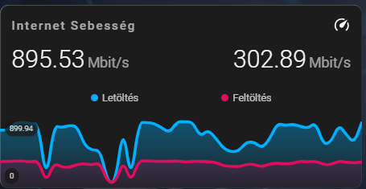

# 🚀 Hálózati Sebességteszt (SpeedTest) Grafikon

Ez a dokumentáció egy elegáns, letisztult kártyát mutat be, amely a Home Assistant internetkapcsolatának sebességét (Letöltés és Feltöltés) vizualizálja. A kártya egyetlen kombinált grafikonon (két különböző színnel) jeleníti meg a hálózati sávszélesség alakulását, tökéletesen illeszkedve a sötét témás rendszerfelügyeleti panelhez.

---

## 🎥 Előnézet

Így mutat a sebességteszt kártya a dashboardon:



---

## ⚠️ Előfeltételek

A kártya működéséhez szükséges egy adatokat szolgáltató integráció, valamint a vizuális elemek megjelenítéséért felelős HACS kártyák telepítése.

### 1. Integráció (Adatforrás)
* **[Speedtest.net integráció](https://www.home-assistant.io/integrations/speedtestdotnet/):** Ezt a Home Assistantban a `Beállítások` -> `Eszközök és szolgáltatások` -> `Integráció hozzáadása` menüpontban tudod telepíteni (keress rá a "Speedtest" szóra).
  *Ez az integráció hozza létre a Letöltés, Feltöltés és Ping szenzorokat.*

### 2. HACS (Home Assistant Community Store) Kártyák
* **[Mini Graph Card](https://github.com/kalkih/mini-graph-card):** A többvonalas (multi-line) grafikon és az alatta lévő színátmenetes kitöltés megjelenítéséhez elengedhetetlen.
* **[Card-mod](https://github.com/thomasloven/lovelace-card-mod):** A kártya sötét hátterének (`#1c1c1c`), a kerekített sarkoknak és az egyedi térközöknek a formázásához szükséges.

---

## 💻 A Teljes Kártya Kódja

Hozz létre egy új, Kézi (Manual) kártyát a dashboardodon, és másold be a következő kódot. 

*(Figyelem: Mentés előtt ellenőrizd az `entities` részben, hogy a `sensor.speedtest_download` és `sensor.speedtest_upload` entitásnevek pontosan megegyeznek-e a saját rendszeredben lévőkkel! Ha a rendszered magyarított nevekkel hozta létre őket, pl. `sensor.speedtest_letoltes`, akkor azt írd be a kódba!)*

```yaml
type: custom:mini-graph-card
name: Internet Sebesség
icon: mdi:speedometer
hours_to_show: 48
points_per_hour: 1
line_width: 4
smoothing: true
entities:
  # --- LETÖLTÉS (Kék színnel) ---
  - entity: sensor.speedtest_download
    name: Letöltés
    color: '#00b0ff'
    show_state: true
  
  # --- FELTÖLTÉS (Magenta/Lila színnel) ---
  - entity: sensor.speedtest_upload
    name: Feltöltés
    color: '#E30B5C'
    show_state: true

show:
  labels: true
  legend: true
  icon: true
  state: true
  fill: fade
card_mod:
  style: |
    ha-card {
      background: #1c1c1c !important;
      border: none !important;
      border-radius: 12px;
      padding: 16px;
    }

```
