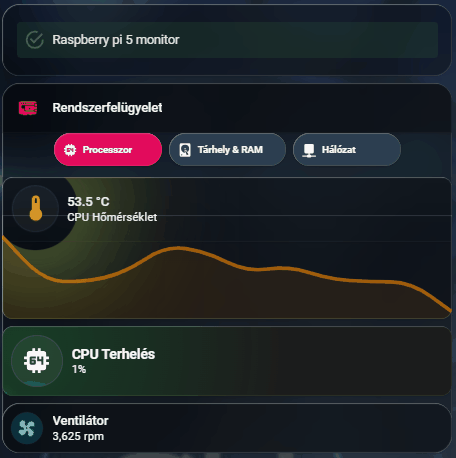

# 🖥️ Rendszerfelügyelet Dashboard (Füles Navigációval)

Ez a dokumentáció a Home Assistant szervert (Raspberry Pi / Mini PC) felügyelő, interaktív és animált dashboard kódját tartalmazza. A panel a fő dashboardról egy navigációs gombbal nyitható meg, és helytakarékos, "füles" (Tab) elrendezést használ.

A rendszer 5 fülre van bontva a logikus átláthatóság érdekében:
1. **Processzor (CPU):** CPU terhelés (folyadékszimuláció), Hőmérséklet (színváltós glória és grafikon), Ventilátor sebesség (forgó animáció).
2. **Tárhely & RAM:** Memória és SSD kihasználtság egyedi, terhelésfüggő "folyadékszint" animációkkal.
3. **Hálózat (Net):** IP címek, hálózati forgalom (lüktető nyilakkal), és utolsó rendszerindítás (izzó szerver ikonnal).
4. **Zigbee (SLZB):** Külön panel a Zigbee koordinátor chipjeinek (Core és Zigbee) hőmérsékletével és az Ethernet kapcsolat állapotával.
5. **Akkumulátor (UPS):** Dedikált fül a szünetmentes tápegység (pl. X1200) töltöttségi szintjének megjelenítésére, dinamikus folyadékszimulációval.

---

## 🎥 Előnézet

Így néz ki a rendszerfelügyeleti panel működés közben:

*(A fenti animációkon látható a CPU és RAM terhelést mutató folyadékszimuláció, valamint a hálózati forgalom lüktetése.)*


---

## ⚠️ Előfeltételek

### 1. HACS (Home Assistant Community Store) Kártyák
* **[Mushroom Cards](https://github.com/piitaya/lovelace-mushroom)**
* **[Mini Graph Card](https://github.com/kalkih/mini-graph-card)**
* **[Vertical Stack In Card](https://github.com/ofekasass/vertical-stack-in-card)**
* **[Card-mod](https://github.com/thomasloven/lovelace-card-mod)** (Az egyedi CSS animációkhoz elengedhetetlen!)

### 2. Segédentitás (Helper) a váltáshoz
A fülek közötti léptetéshez hozz létre egy Szám (Number) segédentitást:
* **Név:** `tabs_system` (Azonosító: `input_number.tabs_system`)
* **Minimum:** 1 | **Maximum:** 5 | **Lépésköz:** 1

---

## 💻 A Teljes Dashboard Kódja

Hozz létre egy új, üres kártyát (Kézi / Manual) a rendszerfelügyeleti nézeteden, és másold be az alábbi, egybeszerkesztett kódot. *(Figyelem: az entitás neveket, különösen az 5. fülön lévő X1200 akku szenzort, szükség esetén cseréld le a saját szervered pontos szenzorneveire!)*

```yaml
type: custom:vertical-stack-in-card
cards:
  # ==========================================
  # FEJLÉC
  # ==========================================
  - type: custom:mushroom-template-card
    primary: Rendszerfelügyelet
    icon: mdi:raspberry-pi
    color: '#E30B5C'
    features_position: bottom
    grid_options:
      columns: 12
      rows: 1
    card_mod:
      style: |
        ha-state-icon {
          animation: heartbeat 3s infinite;
        }
        @keyframes heartbeat {
          0% { transform: scale(1); }
          10% { transform: scale(1.15); }
          20% { transform: scale(1); }
          30% { transform: scale(1.15); }
          40% { transform: scale(1); }
          100% { transform: scale(1); }
        }

  # ==========================================
  # NAVIGÁCIÓS GOMBOK (TABS)
  # ==========================================
  - type: custom:mushroom-chips-card
    alignment: center
    card_mod:
      style: |
        ha-card { margin-bottom: 12px; }
    chips:
      # 1. GOMB: PROCESSZOR
      - type: template
        icon: mdi:cpu-64-bit
        content: CPU
        tap_action:
          action: perform-action
          perform_action: input_number.set_value
          target:
            entity_id: input_number.tabs_system
          data:
            value: 1
        card_mod:
          style: |
            ha-card {
              min-width: 80px !important; max-width: 80px !important;
              background-color: {{ '#E30B5C' if is_state('input_number.tabs_system', '1.0') else '#2C3E50' }} !important;
              position: relative !important;
            }
            .content { justify-content: center !important; }
            ha-state-icon {
              position: absolute !important; left: 10px !important; color: {{ '#FFFFFF' }} !important;
              animation: {{ 'pulse 2s infinite ease-in-out' if is_state('input_number.tabs_system', '1.0') else 'none' }} !important;
            }
            span {
              color: {{ '#FFFFFF' }} !important; font-weight: {{ 'bold' if is_state('input_number.tabs_system', '1.0') else '500' }} !important;
              padding-left: 15px !important;
            }
            @keyframes pulse { 0% { transform: scale(1); } 50% { transform: scale(1.3); } 100% { transform: scale(1); } }
      
      # 2. GOMB: TÁRHELY & RAM
      - type: template
        icon: mdi:memory
        content: RAM
        tap_action:
          action: perform-action
          perform_action: input_number.set_value
          target:
            entity_id: input_number.tabs_system
          data:
            value: 2
        card_mod:
          style: |
            ha-card {
              min-width: 80px !important; max-width: 80px !important;
              background-color: {{ '#E30B5C' if is_state('input_number.tabs_system', '2.0') else '#2C3E50' }} !important;
              position: relative !important;
            }
            .content { justify-content: center !important; }
            ha-state-icon {
              position: absolute !important; left: 10px !important; color: {{ '#FFFFFF' }} !important;
              animation: {{ 'pulse 2s infinite ease-in-out' if is_state('input_number.tabs_system', '2.0') else 'none' }} !important;
            }
            span {
              color: {{ '#FFFFFF' }} !important; font-weight: {{ 'bold' if is_state('input_number.tabs_system', '2.0') else '500' }} !important;
              padding-left: 15px !important;
            }

      # 3. GOMB: HÁLÓZAT
      - type: template
        icon: mdi:network
        content: Net
        tap_action:
          action: perform-action
          perform_action: input_number.set_value
          target:
            entity_id: input_number.tabs_system
          data:
            value: 3
        card_mod:
          style: |
            ha-card {
              min-width: 80px !important; max-width: 80px !important;
              background-color: {{ '#E30B5C' if is_state('input_number.tabs_system', '3.0') else '#2C3E50' }} !important;
              position: relative !important;
            }
            .content { justify-content: center !important; }
            ha-state-icon {
              position: absolute !important; left: 10px !important; color: {{ '#FFFFFF' }} !important;
              animation: {{ 'pulse 2s infinite ease-in-out' if is_state('input_number.tabs_system', '3.0') else 'none' }} !important;
            }
            span {
              color: {{ '#FFFFFF' }} !important; font-weight: {{ 'bold' if is_state('input_number.tabs_system', '3.0') else '500' }} !important;
              padding-left: 15px !important;
            }

      # 4. GOMB: ZIGBEE
      - type: template
        icon: mdi:zigbee
        content: Zigbee
        tap_action:
          action: perform-action
          perform_action: input_number.set_value
          target:
            entity_id: input_number.tabs_system
          data:
            value: 4
        card_mod:
          style: |
            ha-card {
              min-width: 100px !important; max-width: 100px !important;
              background-color: {{ '#E30B5C' if is_state('input_number.tabs_system', '4.0') else '#2C3E50' }} !important;
              position: relative !important;
            }
            .content { justify-content: center !important; }
            ha-state-icon {
              position: absolute !important; left: 10px !important; color: {{ '#FFFFFF' }} !important;
              animation: {{ 'pulse 2s infinite ease-in-out' if is_state('input_number.tabs_system', '4.0') else 'none' }} !important;
            }
            span {
              color: {{ '#FFFFFF' }} !important; font-weight: {{ 'bold' if is_state('input_number.tabs_system', '4.0') else '500' }} !important;
              padding-left: 15px !important;
            }

      # 5. GOMB: AKKUMULÁTOR (UPS)
      - type: template
        icon: mdi:battery-charging
        content: Akku
        tap_action:
          action: perform-action
          perform_action: input_number.set_value
          target:
            entity_id: input_number.tabs_system
          data:
            value: 5
        card_mod:
          style: |
            ha-card {
              min-width: 90px !important; max-width: 90px !important;
              background-color: {{ '#E30B5C' if is_state('input_number.tabs_system', '5.0') else '#2C3E50' }} !important;
              position: relative !important;
            }
            .content { justify-content: center !important; }
            ha-state-icon {
              position: absolute !important; left: 10px !important; color: {{ '#FFFFFF' }} !important;
              animation: {{ 'pulse 2s infinite ease-in-out' if is_state('input_number.tabs_system', '5.0') else 'none' }} !important;
            }
            span {
              color: {{ '#FFFFFF' }} !important; font-weight: {{ 'bold' if is_state('input_number.tabs_system', '5.0') else '500' }} !important;
              padding-left: 15px !important;
            }

  # ==========================================
  # 1. FÜL TARTALMA (PROCESSZOR & VENTILÁTOR)
  # ==========================================
  - type: conditional
    conditions:
      - condition: state
        entity: input_number.tabs_system
        state: "1.0"
    card:
      type: vertical-stack
      cards:
        - type: custom:vertical-stack-in-card
          card_mod:
            style: |
              ha-card { border-radius: 12px; overflow: hidden; }
          cards:
            - type: custom:mushroom-entity-card
              entity: sensor.system_monitor_processzor_homerseklet
              tap_action: { action: more-info }
              icon: mdi:thermometer
              name: CPU Hőmérséklet
              primary_info: state
              secondary_info: name
              card_mod:
                style:
                  mushroom-shape-icon$: |
                    .shape {
                      
                          
                        
                           
                           
                           
                      
                      --temp-rgb: {{ rgb }}; --shape-animation: {{ anim }} {{ duration }}s ease-in-out infinite; --temp-glow-animation: {{ glow_anim }} {{ (duration * 0.9) | round(2) }}s ease-in-out infinite; --temp-halo-animation: {{ halo_anim }} {{ (duration * 1.15) | round(2) }}s ease-in-out infinite;
                      --icon-color: rgba({{ rgb }}, 1); background-color: rgba(77,77,77,0.2) !important; box-shadow: none !important; border: 1px solid rgba(255,255,255,0.06); opacity: 1; position: relative; animation: var(--shape-animation);
                    }
                    .shape::before, .shape::after { content: ''; position: absolute; border-radius: inherit; pointer-events: none; }
                    .shape::before { inset: -8px; animation: var(--temp-glow-animation); }
                    .shape::after { inset: -22px; animation: var(--temp-halo-animation); mix-blend-mode: screen; }
                    @keyframes temp-cold-breathe { 0%, 100% { transform: scale(0.96); } 50% { transform: scale(1.03); } }
                    @keyframes temp-cold-glow { 50% { box-shadow: 0 0 30px 4 rgba(var(--temp-rgb), 0.95), 0 0 50px 10px rgba(var(--temp-rgb), 0.85); } }
                    @keyframes temp-cold-halo { 50% { box-shadow: 0 0 130px 36px rgba(var(--temp-rgb), 0.5), 0 -34px 100px -8px rgba(240, 250, 255, 0.8); } }
                    @keyframes temp-cool-wave { 0%, 100% { transform: translateX(0); } 50% { transform: translateX(1px) translateY(-1px); } }
                    @keyframes temp-cool-glow { 50% { box-shadow: 0 0 28px 2 rgba(var(--temp-rgb), 0.95), 0 0 48px 12px rgba(var(--temp-rgb), 0.85); } }
                    @keyframes temp-cool-halo { 50% { box-shadow: 0 0 140px 42px rgba(var(--temp-rgb), 0.45), 0 30px 110px -10px rgba(0, 255, 255, 0.5); } }
                    @keyframes temp-comfy-breathe { 0%, 100% { transform: scale(0.98); } 50% { transform: scale(1.05); } }
                    @keyframes temp-comfy-glow { 50% { box-shadow: 0 0 30px 4 rgba(var(--temp-rgb), 0.95), 0 0 54px 14px rgba(var(--temp-rgb), 0.9); } }
                    @keyframes temp-comfy-halo { 50% { box-shadow: 0 0 140px 48px rgba(var(--temp-rgb), 0.55), 0 26px 100px -10px rgba(255,210,150,0.5); } }
                    @keyframes temp-hot-shimmer { 0%, 100% { transform: scale(1); filter: blur(0); } 50% { transform: scale(1.08); filter: blur(0.6px); } }
                    @keyframes temp-hot-glow { 50% { box-shadow: 0 0 34px 6 rgba(var(--temp-rgb), 1), 0 0 62px 14px rgba(var(--temp-rgb), 0.95); } }
                    @keyframes temp-hot-halo { 50% { box-shadow: 0 0 160px 60px rgba(var(--temp-rgb), 0.6), 0 34px 120px -12px rgba(255,150,100,0.6); } }
                  .: |
                    mushroom-shape-icon { --icon-size: 50px; }
                    ha-card { background: none; box-shadow: none; border: none; }
            - type: custom:mini-graph-card
              entities:
                - sensor.system_monitor_processzor_homerseklet
              hours_to_show: 24
              line_width: 4
              show: { name: false, icon: false, state: false, labels: false, legend: false }
              color_thresholds:
                - value: 30
                  color: blue
                - value: 50
                  color: orange
                - value: 75
                  color: red
              card_mod:
                style: |
                  ha-card { background: none !important; box-shadow: none !important; border: none !important; opacity: 0.6; margin-top: -30px !important; padding-bottom: 0px !important; }
        - type: custom:mushroom-entity-card
          entity: sensor.system_monitor_processzor_hasznalat
          tap_action: { action: more-info }
          icon: mdi:cpu-64-bit
          icon_color: white
          primary_info: name
          secondary_info: state
          name: CPU Terhelés
          card_mod:
            style:
              .: |
                ha-card {
                  --card-primary-font-size: 15px !important; --card-secondary-font-size: 12px !important; --card-primary-font-weight: bold !important;
                  
                     
                     
                    
                  --custom-level: {{ level }}%; --custom-color: rgba({{ color }}, 0.8);
                  --text-color: {{ 'rgba(' ~ color ~ ', 1)' if level < 101 else 'rgba(255,255,255,0.7)' }};
                  background: #1c1c1c !important; border: none !important; border-radius: 12px; position: relative; overflow: hidden;
                  background-image: radial-gradient(circle at 24px 24px, rgba({{ color }}, 0.15) 0%, transparent 60%) !important;
                }
                mushroom-shape-icon { --icon-size: 55px; }
                ha-card::before { content: '{{ states(config.entity) | replace(",", ".") | float(0) | round(1) }}%'; position: absolute; top: 12px; right: 12px; font-size: 1rem; font-weight: 700; color: var(--text-color); background: rgba(0, 0, 0, 0.3); border: 1px solid rgba(255, 255, 255, 0.1); padding: 2px 6px; border-radius: 4px; }
                ha-card::after { content: ''; position: absolute; bottom: 0; left: 0; height: 4px; width: var(--custom-level); background: linear-gradient(90deg, transparent, var(--custom-color)); box-shadow: 0 0 10px var(--custom-color); }
              mushroom-shape-icon$: |
                .shape { --liquid-level: var(--custom-level); --liquid-color: var(--custom-color); background: rgba(255, 255, 255, 0.05) !important; overflow: hidden !important; position: relative; border: 1px solid rgba(255,255,255,0.1); }
                .shape::before { content: ''; position: absolute; left: -50%; width: 200%; height: 200%; top: calc(100% - var(--liquid-level)); background: var(--liquid-color); border-radius: 40%; animation: liquid-wave 4s linear infinite; opacity: 0.8; }
                ha-icon { position: relative; z-index: 2; mix-blend-mode: overlay; color: white !important; }
                @keyframes liquid-wave { 0% { transform: rotate(0deg); } 100% { transform: rotate(360deg); } }
        - type: custom:mushroom-entity-card
          entity: sensor.system_monitor_pwmfan_fan_speed
          icon: mdi:fan
          name: Ventilátor
          icon_color: cyan
          card_mod:
            style: |
              mushroom-shape-icon {
                display: flex;
                
                
                  
                  
                  animation: fan-spin {{ speed }}s linear infinite;
                
              }
              @keyframes fan-spin { 0% { transform: rotate(0deg); } 100% { transform: rotate(360deg); } }

  # ==========================================
  # 2. FÜL TARTALMA (MEMÓRIA ÉS TÁRHELY)
  # ==========================================
  - type: conditional
    conditions:
      - condition: state
        entity: input_number.tabs_system
        state: "2.0"
    card:
      type: vertical-stack
      cards:
        - type: custom:mushroom-entity-card
          entity: sensor.system_monitor_memoriahasznalat
          tap_action: { action: more-info }
          icon: mdi:memory
          icon_color: white
          primary_info: name
          secondary_info: state
          name: Memória (RAM)
          card_mod:
            style:
              .: |
                ha-card {
                  --card-primary-font-size: 15px !important; --card-secondary-font-size: 12px !important; --card-primary-font-weight: bold !important;
                  
                   
                   
                    
                  --custom-level: {{ level }}%; --custom-color: rgba({{ color }}, 0.8);
                  --text-color: {{ 'rgba(' ~ color ~ ', 1)' if level < 101 else 'rgba(255,255,255,0.7)' }};
                  background: #1c1c1c !important; border: none !important; border-radius: 12px; position: relative; overflow: hidden;
                  background-image: radial-gradient(circle at 24px 24px, rgba({{ color }}, 0.15) 0%, transparent 60%) !important;
                }
                mushroom-shape-icon { --icon-size: 55px; }
                ha-card::before { content: '{{ states(config.entity) | replace(",", ".") | float(0) | round(1) }}%'; position: absolute; top: 12px; right: 12px; font-size: 1rem; font-weight: 700; color: var(--text-color); background: rgba(0, 0, 0, 0.3); border: 1px solid rgba(255, 255, 255, 0.1); padding: 2px 6px; border-radius: 4px; }
                ha-card::after { content: ''; position: absolute; bottom: 0; left: 0; height: 4px; width: var(--custom-level); background: linear-gradient(90deg, transparent, var(--custom-color)); box-shadow: 0 0 10px var(--custom-color); transition: width 0.5s ease; }
              mushroom-shape-icon$: |
                .shape { --liquid-level: var(--custom-level); --liquid-color: var(--custom-color); background: rgba(255, 255, 255, 0.05) !important; overflow: hidden !important; position: relative; border: 1px solid rgba(255,255,255,0.1); }
                .shape::before { content: ''; position: absolute; left: -50%; width: 200%; height: 200%; top: calc(100% - var(--liquid-level)); background: var(--liquid-color); border-radius: 40%; animation: liquid-wave 5s linear infinite; opacity: 0.8; }
                ha-icon { position: relative; z-index: 2; mix-blend-mode: overlay; color: white !important; }
                @keyframes liquid-wave { 0% { transform: rotate(0deg); } 100% { transform: rotate(360deg); } }
        - type: custom:mushroom-entity-card
          entity: sensor.system_monitor_lemezhasznalat
          tap_action: { action: more-info }
          icon: mdi:harddisk
          icon_color: white
          primary_info: name
          secondary_info: state
          name: Lemezhasználat (SSD)
          card_mod:
            style:
              .: |
                ha-card {
                  --card-primary-font-size: 15px !important; --card-secondary-font-size: 12px !important; --card-primary-font-weight: bold !important;
                  
                   
                   
                    
                  --custom-level: {{ level }}%; --custom-color: rgba({{ color }}, 0.8);
                  --text-color: {{ 'rgba(' ~ color ~ ', 1)' if level < 101 else 'rgba(255,255,255,0.7)' }};
                  background: #1c1c1c !important; border: none !important; border-radius: 12px; position: relative; overflow: hidden;
                  background-image: radial-gradient(circle at 24px 24px, rgba({{ color }}, 0.15) 0%, transparent 60%) !important;
                }
                mushroom-shape-icon { --icon-size: 55px; }
                ha-card::before { content: '{{ states(config.entity) | replace(",", ".") | float(0) | round(1) }}%'; position: absolute; top: 12px; right: 12px; font-size: 1rem; font-weight: 700; color: var(--text-color); background: rgba(0, 0, 0, 0.3); border: 1px solid rgba(255, 255, 255, 0.1); padding: 2px 6px; border-radius: 4px; }
                ha-card::after { content: ''; position: absolute; bottom: 0; left: 0; height: 4px; width: var(--custom-level); background: linear-gradient(90deg, transparent, var(--custom-color)); box-shadow: 0 0 10px var(--custom-color); transition: width 0.5s ease; }
              mushroom-shape-icon$: |
                .shape { --liquid-level: var(--custom-level); --liquid-color: var(--custom-color); background: rgba(255, 255, 255, 0.05) !important; overflow: hidden !important; position: relative; border: 1px solid rgba(255,255,255,0.1); }
                .shape::before { content: ''; position: absolute; left: -50%; width: 200%; height: 200%; top: calc(100% - var(--liquid-level)); background: var(--liquid-color); border-radius: 40%; animation: liquid-wave 6s linear infinite; opacity: 0.8; }
                ha-icon { position: relative; z-index: 2; mix-blend-mode: overlay; color: white !important; }
                @keyframes liquid-wave { 0% { transform: rotate(0deg); } 100% { transform: rotate(360deg); } }

  # ==========================================
  # 3. FÜL TARTALMA (HÁLÓZAT)
  # ==========================================
  - type: conditional
    conditions:
      - condition: state
        entity: input_number.tabs_system
        state: "3.0"
    card:
      type: vertical-stack
      cards:
        - type: custom:mushroom-entity-card
          entity: sensor.system_monitor_ipv4_cim_eth0
          icon: mdi:ip-network
          icon_color: blue
          name: IPv4 Cím (eth0)
          primary_info: state
          secondary_info: name
          card_mod:
            style: |
              ha-card { --card-primary-font-size: 15px !important; --card-secondary-font-size: 12px !important; --card-primary-font-weight: bold !important; background: #1c1c1c !important; border: none !important; border-radius: 12px; }
        - type: grid
          columns: 2
          square: false
          cards:
            - type: custom:mushroom-entity-card
              entity: sensor.system_monitor_bejovo_halozati_forgalom_eth0
              icon: mdi:arrow-down-bold-circle-outline
              icon_color: light-green
              name: Letöltés
              primary_info: state
              secondary_info: name
              card_mod:
                style: |
                  ha-card { --card-primary-font-size: 14px !important; --card-secondary-font-size: 11px !important; --card-primary-font-weight: bold !important; background: #1c1c1c !important; border: none !important; border-radius: 12px; }
                  mushroom-shape-icon { animation: pulse-down 2s infinite ease-in-out; }
                  @keyframes pulse-down { 0%, 100% { transform: translateY(0); } 50% { transform: translateY(4px); } }
            - type: custom:mushroom-entity-card
              entity: sensor.system_monitor_kimeno_halozati_forgalom_eth0
              icon: mdi:arrow-up-bold-circle-outline
              icon_color: purple
              name: Feltöltés
              primary_info: state
              secondary_info: name
              card_mod:
                style: |
                  ha-card { --card-primary-font-size: 14px !important; --card-secondary-font-size: 11px !important; --card-primary-font-weight: bold !important; background: #1c1c1c !important; border: none !important; border-radius: 12px; }
                  mushroom-shape-icon { animation: pulse-up 2s infinite ease-in-out; }
                  @keyframes pulse-up { 0%, 100% { transform: translateY(0); } 50% { transform: translateY(-4px); } }
        - type: custom:mushroom-entity-card
          entity: sensor.system_monitor_utolso_rendszerinditas
          icon: mdi:server-network
          icon_color: amber
          name: Utolsó rendszerindítás
          primary_info: state
          secondary_info: name
          card_mod:
            style: |
              ha-card { --card-primary-font-size: 15px !important; --card-secondary-font-size: 12px !important; --card-primary-font-weight: bold !important; background: #1c1c1c !important; border: none !important; border-radius: 12px; }
              mushroom-shape-icon { animation: glow-server 3s infinite alternate; }
              @keyframes glow-server { 0% { filter: drop-shadow(0 0 2px rgba(255, 193, 7, 0.2)); } 100% { filter: drop-shadow(0 0 12px rgba(255, 193, 7, 0.8)); } }

  # ==========================================
  # 4. FÜL TARTALMA (ZIGBEE)
  # ==========================================
  - type: conditional
    conditions:
      - condition: state
        entity: input_number.tabs_system
        state: "4.0"
    card:
      type: vertical-stack
      cards:
        - type: grid
          columns: 2
          square: false
          cards:
            - type: custom:vertical-stack-in-card
              card_mod:
                style: |
                  ha-card { background: #1c1c1c !important; border: none !important; border-radius: 12px; overflow: hidden; }
              cards:
                - type: custom:mushroom-entity-card
                  entity: sensor.slzb_mrw10_rendszermag_chip_homerseklete
                  icon: mdi:thermometer
                  name: Core Temp
                  primary_info: state
                  secondary_info: name
                  card_mod:
                    style:
                      .: |
                        ha-card { --card-primary-font-size: 14px !important; --card-secondary-font-size: 11px !important; --card-primary-font-weight: bold !important; background: none !important; box-shadow: none !important; border: none !important; }
                      mushroom-shape-icon$: |
                        .shape {
                          
                              
                            
                               
                               
                               
                          
                          --temp-rgb: {{ rgb }}; --shape-animation: {{ anim }} {{ duration }}s ease-in-out infinite; --temp-glow-animation: {{ glow_anim }} {{ (duration * 0.9) | round(2) }}s ease-in-out infinite; --temp-halo-animation: {{ halo_anim }} {{ (duration * 1.15) | round(2) }}s ease-in-out infinite;
                          --icon-color: rgba({{ rgb }}, 1); background-color: rgba(77,77,77,0.2) !important; box-shadow: none !important; border: 1px solid rgba(255,255,255,0.06); opacity: 1; position: relative; animation: var(--shape-animation);
                        }
                        .shape::before, .shape::after { content: ''; position: absolute; border-radius: inherit; pointer-events: none; }
                        .shape::before { inset: -8px; animation: var(--temp-glow-animation); }
                        .shape::after { inset: -22px; animation: var(--temp-halo-animation); mix-blend-mode: screen; }
                        @keyframes temp-cool-wave { 0%, 100% { transform: translateX(0); } 50% { transform: translateX(1px) translateY(-1px); } }
                        @keyframes temp-cool-glow { 50% { box-shadow: 0 0 28px 2 rgba(var(--temp-rgb), 0.95), 0 0 48px 12px rgba(var(--temp-rgb), 0.85); } }
                        @keyframes temp-cool-halo { 50% { box-shadow: 0 0 140px 42px rgba(var(--temp-rgb), 0.45), 0 30px 110px -10px rgba(0, 255, 255, 0.5); } }
                        @keyframes temp-comfy-breathe { 0%, 100% { transform: scale(0.98); } 50% { transform: scale(1.05); } }
                        @keyframes temp-comfy-glow { 50% { box-shadow: 0 0 30px 4 rgba(var(--temp-rgb), 0.95), 0 0 54px 14px rgba(var(--temp-rgb), 0.9); } }
                        @keyframes temp-comfy-halo { 50% { box-shadow: 0 0 140px 48px rgba(var(--temp-rgb), 0.55), 0 26px 100px -10px rgba(255,210,150,0.5); } }
                        @keyframes temp-hot-shimmer { 0%, 100% { transform: scale(1); filter: blur(0); } 50% { transform: scale(1.08); filter: blur(0.6px); } }
                        @keyframes temp-hot-glow { 50% { box-shadow: 0 0 34px 6 rgba(var(--temp-rgb), 1), 0 0 62px 14px rgba(var(--temp-rgb), 0.95); } }
                        @keyframes temp-hot-halo { 50% { box-shadow: 0 0 160px 60px rgba(var(--temp-rgb), 0.6), 0 34px 120px -12px rgba(255,150,100,0.6); } }
                - type: custom:mini-graph-card
                  entities:
                    - sensor.slzb_mrw10_rendszermag_chip_homerseklete
                  hours_to_show: 24
                  line_width: 4
                  show: { name: false, icon: false, state: false, labels: false, legend: false }
                  color_thresholds:
                    - value: 30
                      color: blue
                    - value: 50
                      color: orange
                    - value: 75
                      color: red
                  card_mod:
                    style: |
                      ha-card { background: none !important; box-shadow: none !important; border: none !important; opacity: 0.6; margin-top: -30px !important; padding-bottom: 0px !important; }

            - type: custom:vertical-stack-in-card
              card_mod:
                style: |
                  ha-card { background: #1c1c1c !important; border: none !important; border-radius: 12px; overflow: hidden; }
              cards:
                - type: custom:mushroom-entity-card
                  entity: sensor.slzb_mrw10_zigbee_chip_homerseklet
                  icon: mdi:thermometer
                  name: Zigbee Temp
                  primary_info: state
                  secondary_info: name
                  card_mod:
                    style:
                      .: |
                        ha-card { --card-primary-font-size: 14px !important; --card-secondary-font-size: 11px !important; --card-primary-font-weight: bold !important; background: none !important; box-shadow: none !important; border: none !important; }
                      mushroom-shape-icon$: |
                        .shape {
                          
                              
                            
                               
                               
                               
                          
                          --temp-rgb: {{ rgb }}; --shape-animation: {{ anim }} {{ duration }}s ease-in-out infinite; --temp-glow-animation: {{ glow_anim }} {{ (duration * 0.9) | round(2) }}s ease-in-out infinite; --temp-halo-animation: {{ halo_anim }} {{ (duration * 1.15) | round(2) }}s ease-in-out infinite;
                          --icon-color: rgba({{ rgb }}, 1); background-color: rgba(77,77,77,0.2) !important; box-shadow: none !important; border: 1px solid rgba(255,255,255,0.06); opacity: 1; position: relative; animation: var(--shape-animation);
                        }
                        .shape::before, .shape::after { content: ''; position: absolute; border-radius: inherit; pointer-events: none; }
                        .shape::before { inset: -8px; animation: var(--temp-glow-animation); }
                        .shape::after { inset: -22px; animation: var(--temp-halo-animation); mix-blend-mode: screen; }
                        @keyframes temp-cool-wave { 0%, 100% { transform: translateX(0); } 50% { transform: translateX(1px) translateY(-1px); } }
                        @keyframes temp-cool-glow { 50% { box-shadow: 0 0 28px 2 rgba(var(--temp-rgb), 0.95), 0 0 48px 12px rgba(var(--temp-rgb), 0.85); } }
                        @keyframes temp-cool-halo { 50% { box-shadow: 0 0 140px 42px rgba(var(--temp-rgb), 0.45), 0 30px 110px -10px rgba(0, 255, 255, 0.5); } }
                        @keyframes temp-comfy-breathe { 0%, 100% { transform: scale(0.98); } 50% { transform: scale(1.05); } }
                        @keyframes temp-comfy-glow { 50% { box-shadow: 0 0 30px 4 rgba(var(--temp-rgb), 0.95), 0 0 54px 14px rgba(var(--temp-rgb), 0.9); } }
                        @keyframes temp-comfy-halo { 50% { box-shadow: 0 0 140px 48px rgba(var(--temp-rgb), 0.55), 0 26px 100px -10px rgba(255,210,150,0.5); } }
                        @keyframes temp-hot-shimmer { 0%, 100% { transform: scale(1); filter: blur(0); } 50% { transform: scale(1.08); filter: blur(0.6px); } }
                        @keyframes temp-hot-glow { 50% { box-shadow: 0 0 34px 6 rgba(var(--temp-rgb), 1), 0 0 62px 14px rgba(var(--temp-rgb), 0.95); } }
                        @keyframes temp-hot-halo { 50% { box-shadow: 0 0 160px 60px rgba(var(--temp-rgb), 0.6), 0 34px 120px -12px rgba(255,150,100,0.6); } }
                - type: custom:mini-graph-card
                  entities:
                    - sensor.slzb_mrw10_zigbee_chip_homerseklet
                  hours_to_show: 24
                  line_width: 4
                  show: { name: false, icon: false, state: false, labels: false, legend: false }
                  color_thresholds:
                    - value: 30
                      color: blue
                    - value: 50
                      color: orange
                    - value: 75
                      color: red
                  card_mod:
                    style: |
                      ha-card { background: none !important; box-shadow: none !important; border: none !important; opacity: 0.6; margin-top: -30px !important; padding-bottom: 0px !important; }

        - type: grid
          columns: 2
          square: false
          cards:
            - type: custom:mushroom-entity-card
              entity: binary_sensor.slzb_mrw10_ethernet
              icon: mdi:ethernet-cable
              icon_color: info
              name: Ethernet
              primary_info: state
              secondary_info: name
              card_mod:
                style: |
                  ha-card { --card-primary-font-size: 14px !important; --card-secondary-font-size: 11px !important; --card-primary-font-weight: bold !important; background: #1c1c1c !important; border: none !important; border-radius: 12px; }
                  mushroom-shape-icon { animation: pulse-conn 2s infinite ease-in-out; }
                  @keyframes pulse-conn { 0%, 100% { filter: drop-shadow(0 0 2px rgba(3, 169, 244, 0.3)); transform: scale(1); } 50% { filter: drop-shadow(0 0 8px rgba(3, 169, 244, 0.8)); transform: scale(1.05); } }
            - type: custom:mushroom-entity-card
              entity: sensor.slzb_mrw10_rendszermag_uzemido
              icon: mdi:clock-outline
              icon_color: amber
              name: Rendszeridő
              primary_info: state
              secondary_info: name
              card_mod:
                style: |
                  ha-card { --card-primary-font-size: 14px !important; --card-secondary-font-size: 11px !important; --card-primary-font-weight: bold !important; background: #1c1c1c !important; border: none !important; border-radius: 12px; }

  # ==========================================
  # 5. FÜL TARTALMA (X1200 UPS AKKUMULÁTOR)
  # ==========================================
  - type: conditional
    conditions:
      - condition: state
        entity: input_number.tabs_system
        state: "5.0"
    card:
      type: vertical-stack
      cards:
        - type: custom:mushroom-entity-card
          entity: sensor.x1200_battery_level # <-- CSERÉLD KI A PONTOS X1200 SZENZOROD NEVÉRE!
          tap_action: { action: more-info }
          icon: mdi:battery-high
          icon_color: white
          primary_info: name
          secondary_info: state
          name: UPS Töltöttség
          card_mod:
            style:
              .: |
                ha-card {
                  --card-primary-font-size: 15px !important; --card-secondary-font-size: 12px !important; --card-primary-font-weight: bold !important;
                  {% set level = states(config.entity) | replace('%', '') | float(0) %}
                  
                  {# Ide írhatod be a töltésjelző entitásodat, ha van, hogy buborékoljon (pl: is_state('binary_sensor.x1200_charging', 'on') ) #}
                   
                  
                   
                   
                   
                    

                  --custom-level: {{ level }}%; --custom-color: rgba({{ color }}, 0.8);
                  --custom-bubble: {{ 'block' if is_charging else 'none' }};
                  --text-color: {{ 'rgba(' ~ color ~ ', 1)' if level < 101 else 'rgba(255,255,255,0.7)' }};
                  background: #1c1c1c !important; border: none !important; border-radius: 12px; position: relative; overflow: hidden;
                  background-image: radial-gradient(circle at 24px 24px, rgba({{ color }}, 0.15) 0%, transparent 60%) !important;
                }
                mushroom-shape-icon { --icon-size: 55px; }
                ha-card::before { content: '{{ states(config.entity) | float(0) | round(0) }}%'; position: absolute; top: 12px; right: 12px; font-size: 1rem; font-weight: 700; color: var(--text-color); background: rgba(0, 0, 0, 0.3); border: 1px solid rgba(255, 255, 255, 0.1); padding: 2px 6px; border-radius: 4px; }
                ha-card::after { content: ''; position: absolute; bottom: 0; left: 0; height: 4px; width: var(--custom-level); background: linear-gradient(90deg, transparent, var(--custom-color)); box-shadow: 0 0 10px var(--custom-color); transition: width 0.5s ease; }
              mushroom-shape-icon$: |
                .shape { --liquid-level: var(--custom-level); --liquid-color: var(--custom-color); background: rgba(255, 255, 255, 0.05) !important; overflow: hidden !important; position: relative; border: 1px solid rgba(255,255,255,0.1); }
                .shape::before { content: ''; position: absolute; left: -50%; width: 200%; height: 200%; top: calc(100% - var(--liquid-level)); background: var(--liquid-color); border-radius: 40%; animation: liquid-wave 5s linear infinite; opacity: 0.8; }
                .shape::after { content: ''; display: var(--custom-bubble); position: absolute; inset: 0; background-image: radial-gradient(2px 2px at 20% 80%, rgba(255,255,255,0.8), transparent), radial-gradient(2px 2px at 50% 70%, rgba(255,255,255,0.8), transparent), radial-gradient(3px 3px at 80% 90%, rgba(255,255,255,0.8), transparent); background-size: 100% 100%; animation: bubbles-rise 0.7s linear infinite; }
                ha-icon { position: relative; z-index: 2; mix-blend-mode: overlay; color: white !important; }
                @keyframes liquid-wave { 0% { transform: rotate(0deg); } 100% { transform: rotate(360deg); } }
                @keyframes bubbles-rise { 0% { transform: translateY(10px); opacity: 0; } 50% { opacity: 1; } 100% { transform: translateY(-20px); opacity: 0; } }