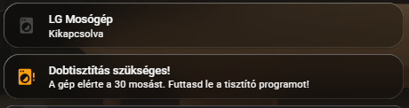
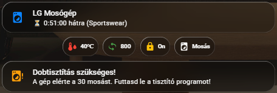
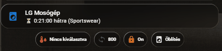

# 🧺 LG Mosógép Állapot és Információs Kártyák

Ez a dokumentáció egy 3 részből álló [Mushroom Card](https://github.com/piitaya/lovelace-mushroom) együttest mutat be, amely egy LG okos mosógép teljes körű felügyeletét teszi lehetővé. A kártyák dinamikusan változnak a gép állapota alapján (kikapcsolt, mosás közben, hiba, karbantartás).

## ⚠️ Előfeltételek a működéshez

Mivel ez a kártya specifikus LG szenzorokra épül, az alábbiak beállítása szükséges a használatához:
1. **LG ThinQ Mobilapplikáció:** A mosógépet fel kell venni a hivatalos LG okostelefonos alkalmazásba, és csatlakoztatni kell az otthoni Wi-Fi hálózathoz.
2. **LG Cloud Fiók:** Szükséged lesz a regisztrált LG ThinQ felhasználónevedre és jelszavadra.
3. **HACS Integráció:** A Home Assistantban a HACS-en keresztül telepíteni kell az **LG ThinQ (SmartThinQ LGE Sensors)** integrációt, és be kell jelentkezni vele az LG fiókodba, hogy a szenzorok (`sensor.mosogep...`) megjelenjenek a rendszerben.

---

## Előnézet

**1. Kikapcsolt / Alapállapot:**



**2. Mosás közben (Részletes infókkal + animálás):** 




---

## 1. Fő Állapot Kártya (Animált)

Ez a kártya mutatja a gép alapvető állapotát. Kikapcsolva "szürke", működés közben kékre vált, kiírja a hátralévő időt és a programot, a gép ikonja pedig **animálva "mosni" (ringani) kezd**. Ha a gép hibát jelez, a kártya pirosra vált, kiírja a hibakódot, és az ikon pulzálni kezd.

```yaml
type: custom:mushroom-template-card
entity: sensor.mosogep
primary: >-
  
    Hiba: {{ states('sensor.mosogep_error_state') }}
  
    LG Mosógép
  
secondary: >-
  
    Kérlek ellenőrizd a gépet!
  
    ⏳ {{ states('sensor.mosogep_remaining_time') }} hátra ({{ states('sensor.mosogep_current_course') }})
  
    Kikapcsolva
  
icon: >-
  
    mdi:washing-machine-alert
  
    mdi:washing-machine
  
tap_action:
  action: more-info
color: >-
  
    red
  
    blue
  
    disabled
  
features_position: bottom
card_mod:
  style: |
    ha-state-icon, ha-icon {
      transform-origin: center;
      display: inline-block;
      
        animation: pulse-red 1s infinite;
      
        animation: wash 1.2s ease-in-out infinite;
      
    }
    @keyframes wash {
      0%, 100% { transform: rotate(0deg); }
      25% { transform: rotate(-15deg) scale(1.05); }
      50% { transform: rotate(0deg) scale(1); }
      75% { transform: rotate(15deg) scale(1.05); }
    }
    @keyframes pulse-red {
      0% { transform: scale(1); }
      50% { transform: scale(1.2); color: darkred; filter: drop-shadow(0 0 5px red); }
      100% { transform: scale(1); }
    }
grid_options:
  columns: full
  rows: 1

```

---

## 2. Részletek Kártya (Chips)

Ez egy *Feltételes (Conditional)* kártya. **Kizárólag akkor jelenik meg, ha a mosógép be van kapcsolva.** Ilyenkor kis "chipekben" mutatja az aktuális mosási paramétereket: vízhőfok, centrifuga fordulatszám, ajtózár állapota és a futási ciklus állapota (pl. mosás, öblítés).

```yaml
type: conditional
conditions:
  - condition: state
    entity: sensor.mosogep
    state: "on"
card:
  type: custom:mushroom-chips-card
  alignment: center
  chips:
    - type: entity
      entity: sensor.mosogep_water_temp
      icon: mdi:thermometer-water
      icon_color: red
    - type: entity
      entity: sensor.mosogep_spin_speed
      icon: mdi:rotate-3d-variant
      icon_color: green
    - type: entity
      entity: binary_sensor.mosogep_door_lock
      icon: mdi:lock
      icon_color: amber
    - type: entity
      entity: sensor.mosogep_run_state

```

---

## 3. Karbantartás Figyelmeztető Kártya (Dobtisztítás)

Ez a kártya is egy *Feltételes (Conditional)* kártya. A legtöbb LG mosógép 30 mosásonként igényli a dobtisztító (Tub Clean) program lefuttatását. Ez a kártya **csak akkor ugrik fel a felületen**, ha a mosásszámláló szenzor értéke átlépi a 29-et.

```yaml
type: conditional
conditions:
  - condition: numeric_state
    entity: sensor.mosogep_tub_clean_counter
    above: 29
card:
  type: custom:mushroom-template-card
  primary: Dobtisztítás szükséges!
  secondary: A gép elérte a 30 mosást. Futtasd le a tisztító programot!
  icon: mdi:washing-machine-alert
  icon_color: orange
  layout: horizontal

```