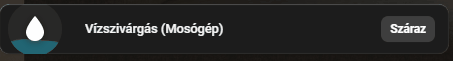

# Vízszivárgás Érzékelő Kártya (Sonoff SNZB-05P)

Ez a kártya egy egyedi, animált vizuális visszajelzést ad a vízszivárgás-érzékelők állapotáról a Home Assistant felületén. A kártya egy [Mushroom Entity Card](https://github.com/piitaya/lovelace-mushroom)-ra épül, és kiterjedt `card-mod` CSS animációkat használ.

## Működés és Animáció
A kártya ikonjában folyamatosan egy "hullámzó folyadék" animáció látható, amely dinamikusan változik az érzékelő állapota szerint:
* **Száraz (Kikapcsolt) állapot:** Az ikonban kék színű, alacsony szintű víz hullámzik.
* **Vizes (Bekapcsolt / Riasztás) állapot:** Az ikonban a víz szintje megemelkedik, a színe pirosra vált, és az egész ikon körül egy piros pulzáló (figyelemfelkeltő) animáció jelenik meg. A kártyán egy "Vizes" feliratú piros címke is megjelenik.

## Előnézet



## YAML Konfiguráció és CSS kód

Az alábbi kódot a Lovelace (Dashboard) felületen egy "Kézi" (Manual) kártya hozzáadásával, vagy a nyers szerkesztőben tudod beilleszteni. 

> **Fontos:** A kód működéséhez telepítve kell lennie a `mushroom-cards` és a `card-mod` (CSS manipulációhoz) kiegészítőknek (HACS-ból beszerezhetők).

```yaml
type: custom:mushroom-entity-card
entity: binary_sensor.bathroom_water_sensor_sonoff_snzb_05p
name: Vízszivárgás (Mosógép)
tap_action:
  action: more-info
icon: mdi:water
primary_info: name
secondary_info: none
grid_options:
  columns: full
card_mod:
  style:
    mushroom-shape-icon$: |
      .shape {
        --liquid-level: var(--custom-level);
        --liquid-color: var(--custom-color);
        background: rgba(255, 255, 255, 0.05) !important;
        overflow: hidden !important;
        position: relative;
        /* Pulzáló animáció hozzáadása a formához */
        animation: var(--pulse-anim);
      }

      /* A víz maga */
      .shape::before {
        content: '';
        position: absolute;
        left: -50%;
        width: 200%;
        height: 200%;
        top: calc(100% - var(--liquid-level));
        background: var(--liquid-color);
        border-radius: 40%;
        animation: liquid-wave 4s linear infinite;
        opacity: 0.85;
        /* Finom átmenet, amikor megváltozik a vízszint vagy a szín */
        transition: top 1s ease-in-out, background 0.5s ease-in-out;
      }

      ha-icon {
        position: relative;
        z-index: 2;
        mix-blend-mode: overlay;
        color: white !important;
      }

      @keyframes liquid-wave {
        0% { transform: rotate(0deg); }
        100% { transform: rotate(360deg); }
      }

      /* A piros pulzáló effekt */
      @keyframes pulse-red {
        0% { box-shadow: 0 0 0 0 rgba(220, 53, 69, 0.7); }
        70% { box-shadow: 0 0 0 15px rgba(220, 53, 69, 0); }
        100% { box-shadow: 0 0 0 0 rgba(220, 53, 69, 0); }
      }
    .: |
      ha-card {
        
        
        /* Színek: Vizesen PIROS, Szárazon KÉK */
        
        
        /* Vízszint: 75% ha vizes, 30% ha száraz */
        
        
        --custom-level: {{ level }}%;
        --custom-color: rgba({{ rgb }}, 0.8);
        --pulse-anim: {{ 'pulse-red 2s infinite' if sensor_on else 'none' }};

        background: #1c1c1c !important;
        border: none !important;
        border-radius: 12px;
        position: relative;
        overflow: hidden;
        transition: all 0.5s ease;
        
        
        background-image: radial-gradient(circle at 24px 24px, rgba({{ rgb }}, 0.15) 0%, transparent 60%) !important;
        
        background-image: none !important;
        
      }

      /* Vizes/Száraz felirat */
      ha-card::after {
        content: '{{ "Vizes" if sensor_on else "Száraz" }}';
        position: absolute;
        top: 50%;
        transform: translateY(-50%);
        right: 16px;
        font-size: 13px;
        font-weight: bold;
        color: white;
        background: {{ 'rgba(220, 53, 69, 0.9)' if sensor_on else 'rgba(255, 255, 255, 0.15)' }};
        padding: 4px 10px;
        border-radius: 8px;
        pointer-events: none;
        z-index: 10;
        transition: background 0.5s ease;
      }

      ha-state-icon {
        color: white !important;
        filter: drop-shadow(0 2px 4px rgba(0,0,0,0.5));
      }

      mushroom-shape-icon {
        --icon-size: 60px;
        display: flex;
        padding-right: 15px;
      }

```
